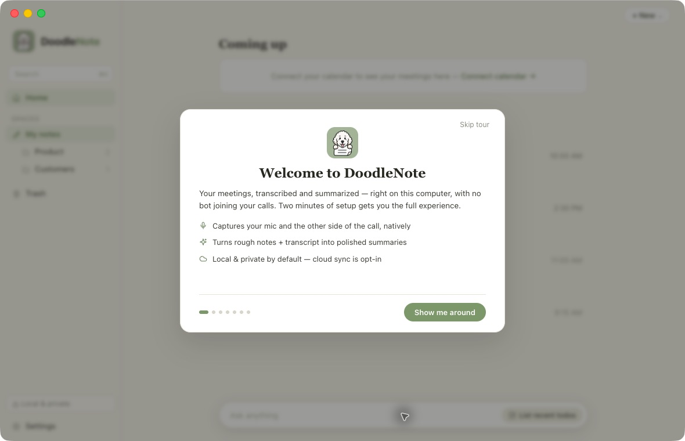
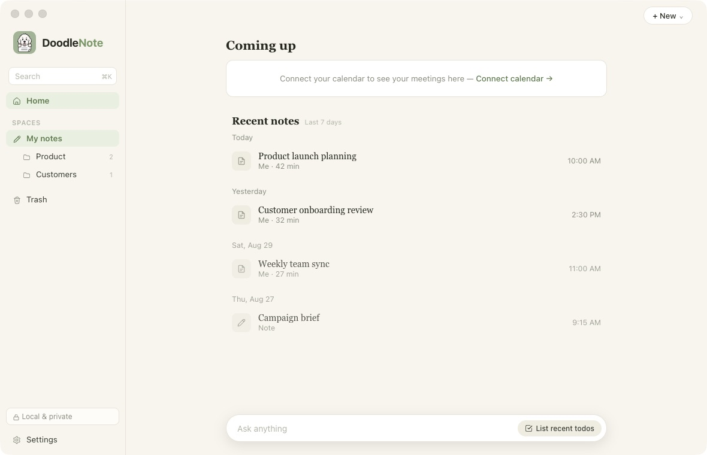
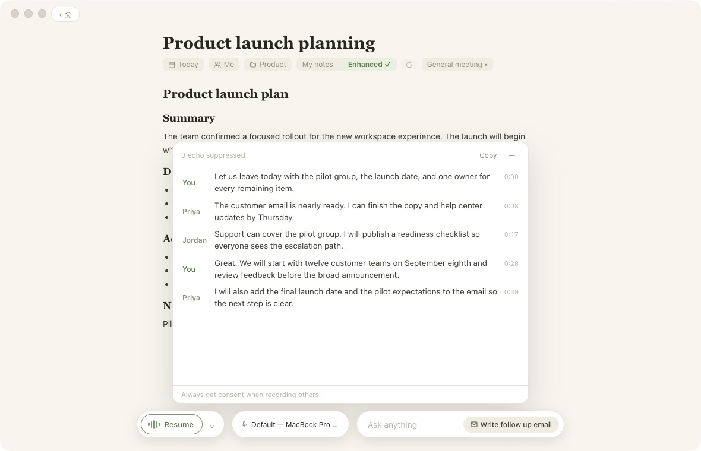
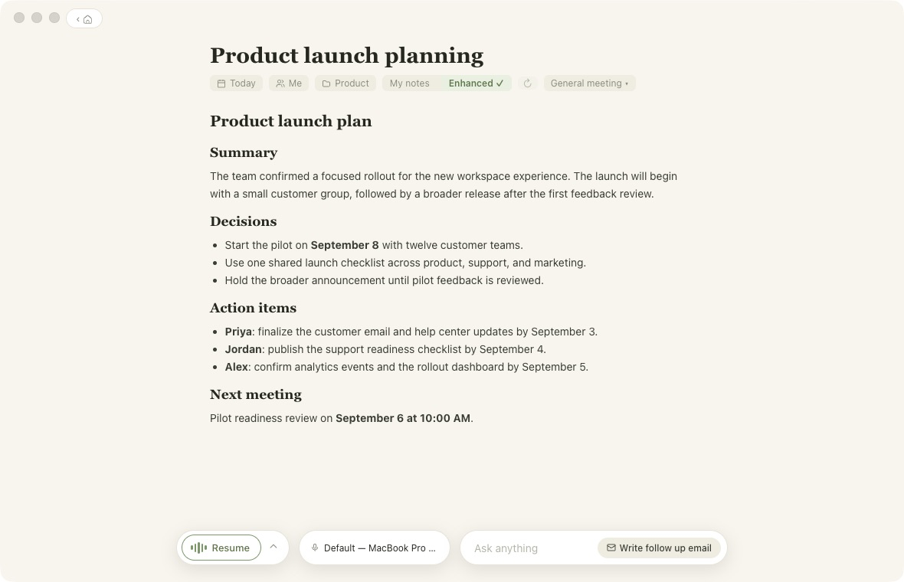
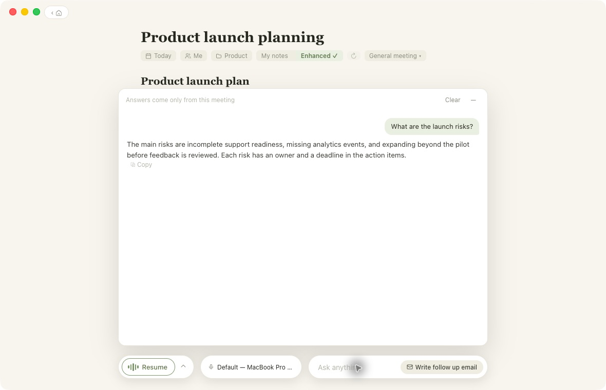

<div align="center">
  <a href="https://www.doodlenote.ai">
    
  </a>

  <p><strong>Privacy-first, local-first meeting capture and AI notes. No meeting bot required.</strong></p>

  <p>
    <a href="https://github.com/Onyx-Dev-Labs/doodle-note/actions/workflows/ci.yml"></a>
    <a href="https://github.com/Onyx-Dev-Labs/doodle-note/actions/workflows/ios.yml"></a>
    <a href="LICENSE"></a>
    <a href="https://www.doodlenote.ai"></a>
  </p>
</div>

DoodleNote captures your microphone and the other side of a call on your computer, transcribes the conversation on-device, and combines the transcript with your rough notes into a useful meeting record. Audio stays on your device. Optional Sync uploads the meeting content you choose, but not the recording audio.

## See DoodleNote in action

### Start private and local

The Mac app introduces the local-first workflow before you record your first meeting. No bot joins the call, and cloud sync stays optional.

<p align="center">
  
</p>

### Find every meeting and note

The home screen keeps recent meetings, quick notes, folders, search, and upcoming calendar events in one place.

<p align="center">
  
</p>

### Review exactly what was said

DoodleNote transcribes both sides locally, keeps speaker labels editable, and preserves timestamps for quick review.

<p align="center">
  
</p>

### Turn the conversation into useful notes

Generate a polished summary with decisions, action items, owners, and the next meeting while keeping the original notes available.

<p align="center">
  
</p>

### Ask a follow-up question

Ask about the open meeting and get an answer grounded only in its notes and transcript.

<p align="center">
  
</p>

## Why DoodleNote

- **No bot in the call.** Capture works from your side with any meeting app.
- **On-device transcription.** Apple Silicon uses the Swift/FluidAudio engine; Windows uses a packaged local speech engine.
- **Local or bring-your-own AI.** Generate notes with a downloaded local model or your own provider key.
- **Notes that stay useful.** Edit rich notes, organize meetings into folders, search history, and ask questions across prior meetings.
- **Capture at the right moment.** Calendar and microphone-aware prompts help you start and stop recordings without stacking notifications.
- **Optional cloud features.** Sync across devices, share selected meetings, and collaborate in workspaces when you opt in.
- **Agent access under your control.** An opt-in, read-only MCP server lets compatible AI tools search local notes and transcripts.

## Get DoodleNote

Download the current desktop installers from
[doodlenote.ai](https://www.doodlenote.ai). Official macOS releases support
Apple Silicon on macOS 14 or later and are signed and notarized. The Windows
10/11 build is currently beta. Its checked-in packaging configuration is
unsigned, so Windows SmartScreen warns before installation.

The local app is free, requires no DoodleNote account, and does not impose
meeting limits. Hosted Sync is optional and costs $10 per user per month.

## Project status

| Surface         | Status         | Notes                                                                                                                 |
| --------------- | -------------- | --------------------------------------------------------------------------------------------------------------------- |
| macOS desktop   | Supported      | Apple Silicon, macOS 14 or later; official releases distributed through [doodlenote.ai](https://www.doodlenote.ai) are signed and notarized. |
| Windows desktop | Beta           | Windows 10/11, 64-bit; packaging and native-module smoke checks run in CI. The current checked-in configuration is unsigned, so SmartScreen warns. |
| iPhone          | In development | Native SwiftUI app targeting iOS 26; full recording verification requires a physical device.                          |
| Web workspace   | In development | Next.js app for account linking, sync, sharing, workspaces, and hosted agent access.                                  |

Public release history is available in [GitHub Releases](https://github.com/Onyx-Dev-Labs/doodle-note/releases) and the [DoodleNote changelog](https://www.doodlenote.ai/changelog). Maintainer release procedures are documented in [docs/RELEASING.md](docs/RELEASING.md).

## Repository map

```text
.github/                 CI, CodeQL, iOS, and release workflows and community configuration
apps/
  desktop/                Electron + React desktop application
  ios/                    Native SwiftUI iPhone application
  web/                    Next.js cloud workspace and public site
docs/                    Brand, open-source, release, and screenshot documentation
engine/                   Swift audio capture and on-device ASR sidecar
packages/
  agent-contract/         Shared MCP tool schemas
  ai/                     Local and cloud note-generation engines
  db/                     Drizzle schema, migrations, Neon/PGlite clients
  doodle-note-mcp/        Opt-in read-only local MCP server
  meetings-store/         Shared meeting persistence contracts
```

## Development

### Prerequisites

- Node.js 22 or later
- pnpm 10.33.2 (Corepack is recommended)
- macOS 14+ on Apple Silicon and Xcode/Swift for the native transcription engine
- XcodeGen and Xcode 26 for iOS work

### Start the workspace

```sh
corepack enable
pnpm install --frozen-lockfile

# Desktop app (build the Mac engine first)
pnpm engine:build
pnpm --filter desktop dev

# Web workspace on http://localhost:4040
pnpm --filter web dev
```

The web app works locally without cloud credentials by using PGlite and a development-only auth secret. Optional integrations are disabled until their environment variables are configured; see [apps/web/README.md](apps/web/README.md).

For a durable production deployment of the Sync server, follow
[SELF-HOSTING.md](SELF-HOSTING.md). Production installations require an
explicit authentication secret and must either configure Stripe or declare
themselves self-hosted.

For native iPhone setup, see [apps/ios/README.md](apps/ios/README.md). For the engine protocol and commands, see [engine/README.md](engine/README.md).

## Verification

Run the checks relevant to your change before opening a pull request:

```sh
pnpm --filter desktop typecheck
pnpm --filter desktop test
pnpm --filter doodle-note-mcp test
pnpm --filter @repo/ai test
pnpm --filter @repo/db test
pnpm --filter web typecheck
pnpm --filter web test
pnpm --filter web build
pnpm lint
pnpm audit --prod --audit-level=low
pnpm engine:build
```

CI also builds the Windows installer and smoke-tests its packaged native speech and local-model modules.

## Privacy and responsible recording

DoodleNote is designed so local capture, transcription, storage, and AI generation can run without sending meeting audio to DoodleNote servers. Cloud sync, shared links, hosted agent access, external AI providers, calendars, and connectors are opt-in features with their own data flows.

Recording and consent laws vary by location and organization. You are responsible for obtaining any required permission before recording or transcribing a conversation.

## Contributing

Issues and pull requests are welcome. Start with [CONTRIBUTING.md](CONTRIBUTING.md), follow the [Code of Conduct](CODE_OF_CONDUCT.md), and report vulnerabilities through the private process in [SECURITY.md](SECURITY.md).

For product and community support boundaries, see [SUPPORT.md](SUPPORT.md).

Brand assets and usage notes live in [docs/BRAND.md](docs/BRAND.md).
The DoodleNote name and mascot are reserved; see [TRADEMARK.md](TRADEMARK.md).

## License

DoodleNote is available under the [MIT License](LICENSE). The local
apps are free forever. Official cloud Sync at
[doodlenote.ai](https://www.doodlenote.ai) is an optional paid backup
and multi-device service ($10 / user / month). See
[docs/OPEN-SOURCE.md](docs/OPEN-SOURCE.md).

Libraries, speech models, and optional local AI models retain their own
licenses. See [THIRD_PARTY_NOTICES.md](THIRD_PARTY_NOTICES.md) before
redistributing a build.
