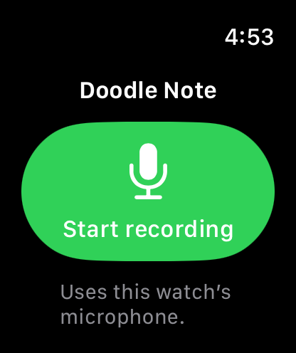

# DoodleNote iOS

Native SwiftUI app (iOS 26+, iPhone-first): record in-person meetings, transcribe
on-device, generate notes with on-device AI, and sync with your DoodleNote
workspace.

## Architecture

- **`DoodleNote/Models.swift`** — SwiftData store (`Meeting`, `Segment`). IDs are
  device-minted UUIDs shared with the cloud, same as desktop.
- **`Recording/`** — `RecordingController` (AVAudioEngine mic tap) feeding a
  `TranscriptionProvider`:
  - `AppleSpeechProvider` (default) — SpeechAnalyzer/SpeechTranscriber, iOS 26.
    System-managed language assets, no download UX.
  - `ParakeetProvider` — FluidAudio `StreamingUnifiedAsrManager`, the same
    Parakeet models as the Mac engine (~440 MB download on first use).
    Selectable in Settings.
- **`AI/`** — `NotePrompt` is a port of `packages/ai/src/prompt.ts` +
  `templates.ts` (single-speaker attribution rule for in-person recordings).
  Engines: `FoundationModelsEngine` (Apple on-device model, default) and
  `AnthropicEngine` (BYOK, key in Keychain).
- **`Sync/`** — `SyncAPI` (typed client for `/api/sync/*`, `dnsy_` Bearer token)
  and `SyncEngine` (push-then-pull cycle, local-edits-win conflict rule,
  `allIds` deletion reconciliation — a simplified port of
  `apps/desktop/src/main/sync-service.ts`). Linking uses
  system Safari → `/link-device?scheme=doodlenote` →
  `doodlenote://link?token=…` (web-side support in
  `apps/web/app/link-device`).

## Build

The Xcode project is generated — edit `project.yml`, not the `.xcodeproj`.

```sh
brew install xcodegen        # once
cd apps/ios
xcodegen generate
xcodebuild -project DoodleNote.xcodeproj -scheme DoodleNote \
  -destination 'platform=iOS Simulator,name=iPhone 17 Pro' build

# UI smoke test (launch → record → stop → notes)
xcodebuild -project DoodleNote.xcodeproj -scheme DoodleNote \
  -destination 'platform=iOS Simulator,name=iPhone 17 Pro' test
```

Or open `DoodleNote.xcodeproj` in Xcode and run. Signing is automatic with the
team set in `project.yml`. Outside contributors can build the simulator with
code signing disabled; a physical-device build requires selecting their own
development team locally.

## Notes

- Point sync at a local web server with the `DOODLE_SYNC_URL` env var
  (Xcode scheme → Run → Environment Variables), mirroring the desktop app.
- Foundation Models requires Apple Intelligence to be enabled; the app falls
  back with a clear error directing users to BYOK otherwise.
- Simulator caveat: speech assets and Apple Intelligence are often unavailable
  in simulators — full recording/notes verification needs a physical device.


## Apple Watch recording preview



The Debug build includes a native watchOS 26+ companion (`DoodleNoteWatch` scheme).
The paired iPhone must run Doodle Note on iOS 26+. The watch uses its own microphone;
the phone does not need to be reachable to start or save a recording. Open the app
on the watch and tap **Start recording**, then **Stop & save**. Audio background
mode is declared for a foreground-started recording to continue with the screen
asleep. Actual behavior still requires the paired-device acceptance checks below.

Completed recordings queue through WatchConnectivity. The iPhone copies the
received file before the temporary transfer URL expires and sends a receipt only
after its audio and manifest are saved. UUIDs make retries idempotent. A transfer
error leaves the watch copy intact; use **Retry transfer** after reconnecting.

In the iPhone home screen, open **Watch recordings**, then **Transcribe & add to
meetings**. Keep the iPhone app foregrounded during transcription. SpeechAnalyzer
processes the file on the phone; speech assets may download on first use. Open the
resulting meeting to generate notes using the existing notes flow. Audio export is
available from the inbox. Existing workspace sync applies to the resulting text;
raw watch audio is not uploaded by this feature.

Audio is mono 16-bit PCM at 16 kHz in CAF, approximately 115 MB/hour before file
headers. This development preview retains audio on both devices, including after
receipt and transcription. There is no automatic deletion, retention policy UI,
or storage reclamation yet. Starts are rejected below 64 MB free capacity;
recordings stop at 24 hours, or earlier if interrupted or storage runs out. Actual
battery life and practical meeting length have not been measured.

Watch recording and the iPhone inbox are disabled in Release builds pending real
hardware acceptance. The Release watch target displays an unavailable message.
Do not ship the companion bundle before acceptance and release-gate review.

```sh
xcodebuild -downloadPlatform watchOS # required even for embedded iPhone tests
xcodegen generate
xcodebuild -project DoodleNote.xcodeproj -scheme DoodleNoteWatch \
  -destination 'generic/platform=watchOS Simulator' CODE_SIGNING_ALLOWED=NO build
```

### Required paired-device acceptance before release

- Start on the watch with the iPhone unreachable. Confirm the audio comes from
  the watch microphone, including with AirPods connected.
- Record a real-length meeting with wrist lowered, screen asleep, and another app
  foregrounded. Check audio continuity, duration, watch battery use, and storage.
- Deny microphone permission, then enable it and retry. Interrupt recording with
  a call. Force-quit/relaunch during recording and check CAF recovery.
- Stop offline, reconnect, and confirm the receipt only after the phone has saved
  audio. Retry the same UUID and relaunch both apps without duplicate meetings.
- Transcribe a known synthetic sample on a physical iPhone with installed speech
  assets, then with missing assets. Confirm the transcript tail and note generation.
- Exercise unavailable speech, silence, low storage, transfer failure, and
  interruption during transcription. Ensure original audio remains exportable.
- Add retention/deletion controls and complete the final App Store
  privacy/signing review before enabling Release. Simulator WatchConnectivity
  file transfer is not an acceptance substitute.

Apple references: [background audio](https://developer.apple.com/documentation/watchkit/playing-background-audio),
[file transfer](https://developer.apple.com/documentation/watchconnectivity/wcsession/transferfile(_:metadata:)).
