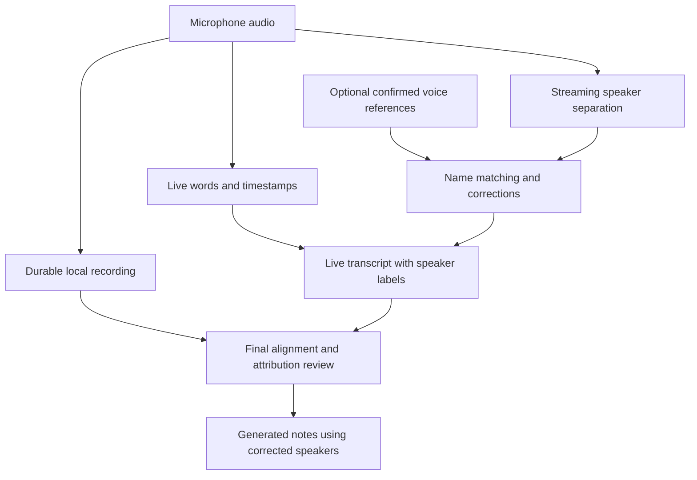

# DoodleNote speaker identification proposal

Status: Explanation and proposed design for question 27. Live labels are requested if feasible, with a three-to-four-speaker target. Persistent recognition across meetings is not yet accepted. No prototype, model download, or device test has been performed.

## What identification means

Speaker separation determines which stretches of audio belong to different voices. Named identification associates a voice with a person whose name has been supplied or confirmed. Recognition across meetings additionally requires a reusable voice reference and a matching process.

A transcript engine cannot reliably discover an unknown person's real name from voice alone. A contact or attendee list supplies possible names, not the evidence linking each name to a voice. Spoken introductions can help the user assign a name but should not silently become verified identity.

## Recommended experience

1. Start recording immediately. Show the live text and anonymous Speaker 1/2 labels while identity is unknown; label timing must be established by testing.
2. Tap a speaker label to assign a name. Keep subsequent turns from that tracked speaker associated with the name, with visible handling for uncertainty and corrections.
3. Optionally select known participants before future recordings. Build a reusable reference only from a clear solo sample or an explicitly confirmed clean excerpt from an earlier recording.
4. Offer Remember this voice on this device separately. Do not require enrollment to capture a meeting. Saved-profile functionality remains a proposal pending Sean's decision.
5. Match incoming speech to the selected profiles when evidence is sufficient. Leave an unknown guest or ambiguous speech unassigned rather than force one of the selected names.
6. Let corrections apply to a passage or to the tracked speaker across the meeting. Do not automatically update a saved voice reference from uncertain or corrected-away speech.
7. After recording, refine attribution and generate notes using the current speaker mapping. Question 42 now requires preserving manual edits and creating a new generated version for review before replacement. Exact identity propagation and version implementation remain to be designed.

Illustrative screen content below uses fictional meeting statements, not real transcript data:

```text
Recording

Sean       We need to confirm the installation date.
Speaker 2  I can check the building schedule.
           [Assign name]
Maria      Thursday would work for our team.
```

The record should clearly distinguish named, anonymous, and uncertain attribution. Avoid presenting an uncalibrated model score as a percentage certainty.

## Proposed processing flow



## Work required

- Integrate durable audio capture with concurrent on-device transcription and speaker processing. Keep recording safe if either model fails or falls behind.
- Select downloadable model versions, verify distribution rights, and manage device eligibility, storage, loading, and readiness.
- Reconcile transcription timestamps with speaker segments, including provisional versus finalized output, pauses, resampling, returning speakers, and overlap.
- Maintain stable meeting speaker IDs and confirmed names. Speaker-slot numbers alone must not become a permanent person identity across sessions.
- Build participant selection, reference capture, matching, correction, and profile deletion if persistent identification is accepted.
- Protect local voice-reference data. Keep it outside ordinary cloud note synchronization unless a separate profile-sync design is accepted. Whether references retain audio or embeddings depends on the chosen pipeline and must be explicit in the product.
- Carry corrected names through transcript playback, generated notes, export, and cloud-synced meeting content. Existing cloud payloads include speaker-label strings but do not yet establish a complete stable-person/profile contract.
- Validate three to four speakers with similar voices, different distances, unknown guests, long silence, overlapping speech, and the selected languages. Validate the complete two-hour pipeline on the minimum supported physical iPhone and iPad, including Pencil use, heat, battery, memory, screen lock, calls, and recovery.

This is multiple integration components using existing pretrained models, not a proposal to train a foundational voice model from scratch. Device testing must establish false-name rates, unknown-speaker rejection, label delay, identity stability, and the supported-device floor before making product claims.

## Concrete technical routes

### First comparison: native Sortformer enrollment

[FluidAudio's diarizer protocol](https://raw.githubusercontent.com/FluidInference/FluidAudio/main/Sources/FluidAudio/Diarizer/DiarizerProtocol.swift) and [Sortformer implementation](https://raw.githubusercontent.com/FluidInference/FluidAudio/main/Sources/FluidAudio/Diarizer/Sortformer/SortformerDiarizer.swift) expose enrollment using reference audio and a supplied name. Enrollment warms the session cache; live processing then emits timed speaker segments.

This gives a direct candidate for named live labels for up to four unique speakers. It does not supply persistent profile storage or a calibrated name-confidence probability. Enrollment selects a dominant slot, can collide with another named slot, and resets the visible timeline. Perform it before recording, reject name collisions, and handle mid-meeting newcomers through application labeling rather than resetting the running diarizer. Reusing it across meetings would require retaining suitable reference audio and enrolling it again per session.

The [Sortformer guide](https://raw.githubusercontent.com/FluidInference/FluidAudio/main/Documentation/Diarization/Sortformer.md) documents four-speaker capacity, tentative/final segments, memory/precision trade-offs, and overlap/distance limitations. Favorable upstream integration feedback is not a DoodleNote benchmark.

### Second comparison: live separation plus reusable voice embeddings

[EmbeddingExtractor](https://raw.githubusercontent.com/FluidInference/FluidAudio/main/Sources/FluidAudio/Diarizer/Extraction/EmbeddingExtractor.swift) and [SpeakerManager](https://raw.githubusercontent.com/FluidInference/FluidAudio/main/Sources/FluidAudio/Diarizer/Clustering/SpeakerManager.swift) provide components for extracting voice representations and matching against known speakers. [Speaker profile types](https://raw.githubusercontent.com/FluidInference/FluidAudio/main/Sources/FluidAudio/Diarizer/Clustering/SpeakerTypes.swift) can be serialized but do not implement disk persistence or encryption for the app.

Connecting those components to live Sortformer slots, restricting matches to selected participants, calibrating acceptance thresholds, preserving unknown speakers, and maintaining corrected profiles would be custom DoodleNote work. This route may avoid retaining separate reusable voice clips, but embeddings still require protection and can remain incompatible across model versions.

An offline final diarizer may improve the completed transcript, but its speaker IDs must be reconciled with confirmed live names rather than blindly replacing them.

## Selection gate

Compare the simplest enrollment path and the embedding path on actual target devices before committing architecture or scheduling the full implementation. Review exact model artifacts: [Sortformer upstream](https://huggingface.co/nvidia/diar_streaming_sortformer_4spk-v2.1) and [converted model](https://huggingface.co/FluidInference/diar-streaming-sortformer-coreml) currently display different license labels. Resolve the terms or select a compatible alternative before embedding the model in a distributed app.

The local approach does not inherently require a paid per-minute inference service. Engineering, device/language testing, model delivery, and any licensed components still have costs; no budget or delivery estimate has been established.

## Interface localization

Sean requests app screen text in the language chosen during setup. Apple's [string catalogs](https://developer.apple.com/documentation/xcode/localizing-and-varying-text-with-a-string-catalog) support translated strings, plurals, and device variants; localization is standard native-app work.

Include app-owned onboarding, buttons, settings, errors, accessibility labels, and relevant generated UI headings, plus locale-appropriate dates/numbers and layout testing on iPhone/iPad. Translation completeness and language review are real work, but no technical blocker to this scope has been found. System-owned prompts and external provider/account pages remain controlled by their respective surfaces and need separate integration handling.

Sean subsequently accepted English, Danish, Spanish, French, and German as launch languages, including translated interface text. Each recording uses one selected primary spoken language; generated notes default to that language with an optional supported output-language override. Preserve the original-language transcript. Automatic mixed-language switching is deferred pending separate validation.
