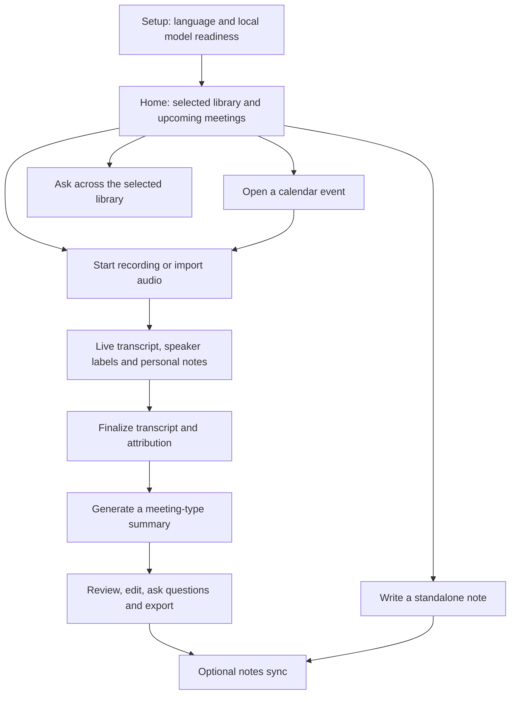

# DoodleNote for iPhone and iPad

Updated: 2026-09-06

Status: Approved by Sean on 2026-09-06, including feature decisions through Q48 and operational defaults D1-D6. Implementation may begin. Device, model, integration, and release acceptance gates remain open.

## Purpose and boundary

Build a fresh, independent iPhone and iPad app for professionals to record in-person conversations, take personal notes, and obtain useful transcripts, summaries, and next actions. It must also support standalone notes and imported audio.

Ignore existing iOS code and design choices. Existing desktop/web/shared sources are references for product and cloud compatibility, not a mobile implementation to port. Preserve the current repository's unrelated work.

Core local functionality is free and does not require a DoodleNote account. The existing paid cloud-sync service is optional. External AI is optional, explicitly enabled, uses the user's own provider credentials, and has separate provider costs. There is no approved new managed-inference subscription or pricing change.

## Accepted first-release capabilities

| Area | Required behavior |
| --- | --- |
| Recording | User-started microphone capture, audio-file import, local playback, and durable audio preservation. In-person conversations and meeting audio from another device are in scope. |
| Live transcript | Accurate text while recording, with timestamps linked to local audio. Work offline on supported devices after required models are ready. |
| Speakers | Pursue automatic separation/identification and live labels for three to four speakers, subject to demonstrated feasibility. Preserve clear unknown/uncertain attribution. Calendar invitees are suggestions, not voice identity. |
| Notes | Standalone notes plus typed personal notes during recording. Keep personal notes distinct from generated content. |
| iPad | Dedicated notes/transcript layout, keyboard support, editable Pencil handwriting/sketches, and handwriting converted to typed text. |
| Summaries | Offline generation in supported languages on supported devices after model readiness. Include supported key points, decisions, and checklist actions. Never invent owners, dates, or commitments. |
| Formats | General meeting; client discovery; project/status update; one-to-one; interview; training/workshop. |
| Editing | Summaries are editable. Regeneration preserves the edited version and creates a new generated version for review before replacement. |
| Meeting questions | Answer using the current meeting's transcript and typed notes, with supporting-passage links. Work offline over available content with required models ready. |
| Homepage questions | Search the full history of eligible recordings/transcripts and notes in the selected library/workspace, with an explicit scope selector for other authorized libraries. Exclude Trash and expose unavailable/unindexed content. Work offline when content and models are ready. |
| Organization | Recent-first library, optional folders, and search across typed notes, summaries, and transcripts. |
| Calendars | Direct, read-only Microsoft 365/Office 365 and Google Calendar integration. Multiple accounts per provider, selected calendars, upcoming events, reminders, meeting links, event-linked notes, and optional invitee-name suggestions. |
| Cloud sync | Explicitly select a library/workspace for automatic note sync and retain a separate local-only library. Include notes, transcripts, editable ink, readable previews, Trash state, and preserved conflicts/summary versions. |
| Audio ownership | Audio remains on the recording/importing device until removed by the user. Notes sync does not enable playback of that audio on other devices. |
| Export | PDF and Markdown sharing, plus a complete export/restore archive through Files that preserves notes, transcripts, ink, and local audio. |
| Recovery | Recoverable Trash for 30 days, synchronized Trash state for synced notes, and explicit confirmation for immediate permanent deletion. |

The accepted two-hour recording/import target is an initial validation baseline, not a hard recording cutoff or a measured performance claim. Longer content must never be silently truncated.

## Languages

Launch with English, Danish, Spanish, French, and German, including DoodleNote interface text. Language selection during setup must affect onboarding, normal screens, buttons, settings, errors, and other app-owned text. Test accessibility text, dates/numbers, plurals, and iPhone/iPad layouts.

Each recording has one selected primary spoken language. Its transcript preserves that language. Generated notes default to the selected spoken language, with an optional supported output-language override. Automatic switching between spoken languages in one recording is outside the first-release commitment.

Model availability and language quality must be checked independently from interface translation. A translated interface must not imply that an unavailable speech model is ready. Keep already captured data usable when assets are missing or processing fails, and offer local retry or the user's explicitly configured alternative where applicable.

## Main user flows

- Setup does not require DoodleNote account creation. Make model download/readiness and optional calendar/sync connections understandable. Do not block plain note-taking because a model is unavailable.
- Recording shows a clear recording state, live text, personal notes, and speaker labels when supported. Preserve audio independently of AI progress. Screen lock and app switching must be tested; interruptions require visible state and a clear resume path.
- iPad supports side-by-side note/transcript work and Pencil input. iPhone must provide usable access to the same meeting content without a compressed desktop layout.
- Finalization may improve transcription and attribution after recording. Corrections must not silently destroy personal edits or apply a guessed identity to another speaker.
- Source links from summaries/questions lead to the relevant transcript or typed-note passage. Playback requires audio on the current device; a synced transcript must clearly distinguish missing local audio.

These flows identify functional surfaces, not a finalized visual layout. Exact navigation and interaction design must preserve this capability inventory.

## Questions, retrieval, and evidence

Search all eligible history in the selected scope, not a fixed newest-record window. Bounded model context is acceptable, but retrieval must be able to find relevant old transcript passages and typed-note details. A question about complete counts or lists must not receive an apparently exhaustive answer derived only from a few retrieved excerpts.

Show the selected scope and any processing/download gaps. Do not silently mix unrelated workspaces, use Trash, or include content from a disconnected/unavailable account. Index updates must follow note edits, speaker corrections, version selection, and Trash changes.

Ground answers in transcript and typed notes. Generated summaries may assist retrieval but must not substitute for checking original evidence. Distinguish user-written notes from recorded speech when they conflict. Preserve uncertainty and explain when the available evidence does not answer the question.

Saved ink is visible and exportable, but automatic ink recognition, ink search, and AI interpretation of sketches/handwriting are excluded. Text entered through handwriting-to-text input is ordinary typed text and can participate.

## Calendar behavior

Connect Microsoft/Google accounts independently of DoodleNote cloud sync. Let the user choose accounts and calendars, see upcoming events and cached offline information, follow meeting links, and create/reopen a titled event-linked note. Retain user-created notes when an event changes or disappears.

The desktop 14-day upcoming view is the initial parity reference. Fetch complete results for the chosen date range, handle recurring occurrences, and avoid duplicate notes for the same occurrence within its library. Preserve user-edited note content when calendar metadata changes.

Use opt-in reminders leading to meeting actions and explicitly user-started recording. Do not depend on exact background polling or automatic microphone activation at a scheduled time. A Join action opens the provider's meeting link; it does not capture another app's call audio.

Invitees can be suggested participants. Names must still be associated with confirmed voices. Read-only integration does not create/edit calendar events or send invitations. Multiple account support does not automatically promise enterprise delegated-mailbox access; validate the calendars available under granted read permissions, and surface any unsupported calendar type accurately.

## Sync and compatibility

Mobile must connect to the existing cloud service. Required ink, conflict, recovery, and version behavior needs compatible extensions; it cannot be fulfilled by assuming the current payload already supports it.

Maintain a clear local-only library and explicit synced-library/workspace ownership. Preserve both conflicting versions for reconciliation. Do not silently overwrite user work, upload a local-only note, move content between accounts, or resurrect a deleted record because an older device reconnects.

Protect ink assets; the existing image route's public-asset behavior is not an acceptable assumption for private handwritten notes. Validate iPad editing, iPhone preview, desktop visibility, old-client behavior, sync authentication, and entitlement handling separately.

Existing authenticated provider/account configuration and production deployment are not changed by approving this product specification. Compatibility work must have a reviewed migration/rollback path before production changes.

## Accepted operational defaults

Sean accepted these defaults with the final specification on 2026-09-06.

| ID | Accepted default |
| --- | --- |
| D1: Remembered speakers | Include optional saved voice references on the device. Recording works without enrollment. Users confirm names, choose whether to remember a voice, and can remove profiles. Known participants may be selected before later meetings; unknown/ambiguous speech stays unassigned. Do not upload voice profiles through notes sync or update a profile from uncertain speech. |
| D2: Backup/restore | Use a password-protected encrypted archive for full-fidelity backup. Include notes, transcripts, ink, local audio, and retained summary versions; exclude provider/API credentials and saved voice profiles initially. Restore into a local-only library, preserve duplicate/conflicting versions, and require deliberate sync selection afterward. PDF includes ink; Markdown export includes necessary ink-image assets rather than silently losing it. |
| D3: Account and deletion behavior | A sync lapse or disconnect must not erase local notes or remove free local capabilities. Explicit sign-out isolates account-bound cached content from other accounts until the same account reauthenticates; local-only content remains available. Calendar disconnect clears that connection/cache while preserving created notes. Trash keeps associated local audio recoverable on its original device during the retention period; removing audio separately preserves text/ink. Process expiry when the app/service can run; do not claim powered-off devices or exported backups were erased. |
| D4: Optional external AI | Start with OpenAI, Anthropic, Groq, and OpenRouter for optional text summaries/Q&A, corresponding to current desktop cloud-provider categories. Keep initial transcription/speaker processing on-device. Store keys locally in protected credential storage, outside sync/backups. Clearly disclose and explicitly enable transmission to the chosen provider; never silently fall back. Cloud audio transcription and network-hosted Ollama are outside the initial integration scope. |
| D5: Distribution | Use a device-tested TestFlight beta before App Store release. Plan a free install with existing Sync-account sign-in initially. Do not add purchasing or external purchase calls to action until the App Review route is verified for this product. No new subscription price is proposed. Provider OAuth production configuration and verification are release dependencies, not assumed completed work. |
| D6: Implementation approach | Start a fresh native SwiftUI implementation in an isolated editing workspace. First build an integrated device feasibility slice, then choose the engine/model/device matrix using evidence. Reuse cloud compatibility knowledge without importing the old iOS implementation. Do not promise older-device coverage from an OS-version check alone or silently drop accepted features if the first candidate fails. |

## Evidence-dependent decisions after the prototype

- Exact speech, speaker, local-generation, and retrieval engines; pinned model artifacts and distribution rights.
- Minimum supported OS and physical devices for simultaneous capture, live transcription, speaker labels, Pencil use, and offline processing in every launch language.
- Calibrated transcript/speaker quality and latency targets, model-download/storage requirements, battery/heat/memory results, and long-recording behavior. These need measured baselines and agreed acceptance thresholds, not invented performance claims.
- Native OAuth client configuration, exact read scopes, provider verification, account/permission edge cases, and App Review acceptance of the actual sync/AI experience.
- Concrete schema/versioning, private ink storage, deletion/conflict protocol, and backward-compatible desktop/web changes.

These implementation investigations are authorized by the confirmed shared understanding. They do not turn unmet user requirements into optional features automatically.

## Validation and delivery plan

| Stage | Required evidence |
| --- | --- |
| 1. Native feasibility slice | Run local recording, live multilingual text, three-to-four-speaker labeling and Pencil editing together on physical iPhone/iPad. Preserve the complete two-hour session. Compare model candidates and document artifact rights. Use test material whose use is authorized. |
| 2. Offline intelligence | Evaluate summaries and meeting/library questions for each launch language, including different supported summary output languages. Show source links, unknown answers, old-record retrieval, and scope isolation. |
| 3. Recovery and readiness | Test missing models, airplane mode, slow/failed processing, low storage, screen lock, app switching, calls, restart, interrupted import, and retry. Check complete audio and editable notes survive. |
| 4. Calendars | Exercise multiple Microsoft/Google accounts, selected calendars, pagination, recurring/rescheduled/canceled events, refresh, cached offline display, reminders, attendee suggestions, reauthentication, and disconnect without deleting notes. |
| 5. Cloud compatibility | Prove note/transcript/ink sync, readable desktop/iPhone previews, conflicts, preserved versions, Trash/offline deletion behavior, account isolation, and expiry/disconnect handling against a safe test environment. |
| 6. Export and usability | Round-trip the complete archive including audio/ink, reject incorrect passwords/corrupt archives safely, preserve restore conflicts, and check PDF/Markdown completeness. Review all five UI languages, accessibility, keyboard and Pencil behavior on both device sizes. |
| 7. Reviewed release | Produce supported-device/model matrix, known limits, test evidence, provider/App Store readiness, and any required migration/rollback plan. TestFlight/public release and production changes remain separate from source completion. |

A failed device test must produce an evidenced recommendation and a decision about engine, hardware, or scope. It must not be described as passing because a library's documentation or a simulator build succeeded.

## Explicit first-release exclusions

- Video import; same-device phone/Teams/Zoom/other-app call-audio capture; unattended calendar-triggered recording.
- Automatic mixed-language switching within one recording.
- Automatic understanding or search of preserved ink.
- Cloud recording-audio sync and cloud voice-profile sync.
- Public sharing links, real-time collaborative editing, calendar event editing/invitations, and external task assignment/reminder integrations.

A custom summary-template builder, specialist enterprise delegated-calendar behavior, remote local-model servers, and additional integrations are not launch commitments. Their absence must not remove the accepted built-in formats or ordinary connected-calendar support.

## Decision records and evidence

- [Interview and decision history](./doodlenote_Discovery_v1.md)
- [Concise product brief](./doodlenote_Product-Brief_v1.md)
- [Domain glossary](./CONTEXT.md)
- [Read-only feasibility research](./doodlenote_Feasibility_v1.md), gathered 2026-09-05; revisit drifting facts before implementation or release.
- [Speaker identification proposal and diagram](./doodlenote_Speaker-Identification_v1.md)
- [Independent product and existing sync](./docs/adr/0001-independent-mobile-with-existing-sync.md)
- [Explicit external AI and local recording audio](./docs/adr/0002-explicit-external-ai-and-local-audio.md)
- [Ink and conflict preservation](./docs/adr/0003-extend-sync-for-ink-and-conflict-preservation.md)

Sean confirmed shared understanding of this scope and defaults on 2026-09-06, authorizing the implementation phase. This document does not claim production, App Store, OAuth, model-license, or device-performance validation.
