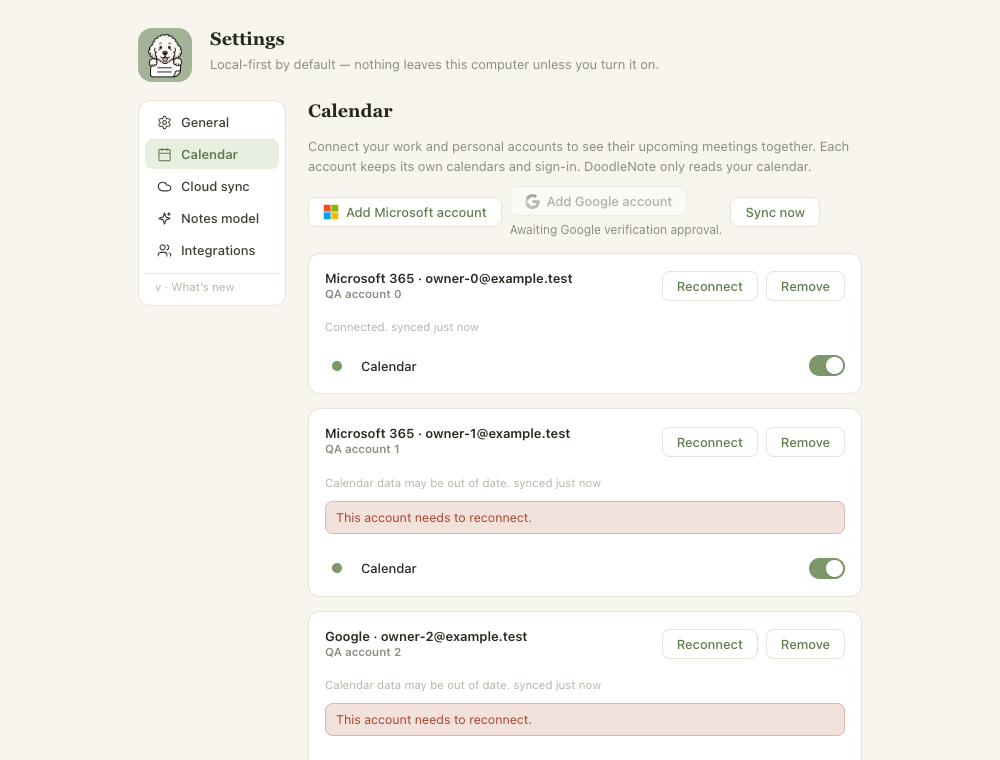

# Existing Google account reconnect

When a saved Google Calendar account needs authorization again, Settings used the
new-account verification gate to disable its Reconnect button. The renderer now
allows the existing account to reconnect while Add Google account stays disabled.
An active sign-in still disables all reconnect actions. The existing provider and
account ID are passed through the unchanged OAuth path, which rejects a different
Google subject without replacing the saved account.

## Verification

- The updated renderer test failed before the fix with: `Existing Google accounts
  must reconnect while new Google connections are gated`.
- `DOODLE_PLAYWRIGHT_MODULE=/path/to/playwright node apps/desktop/scripts/test-calendar-accounts.cjs`
  passes against the actual Settings component at 1000x760/light and 800x560/dark.
  It covers Google reconnect with the new-account gate closed, targeted account ID,
  keyboard activation, concurrent sign-in prevention, cancellation, Microsoft
  reconnect, single-account removal and preserved calendar selection controls.
- `pnpm --filter desktop exec tsx --test src/main/google-calendar.test.ts src/main/calendar-account-integration.test.ts src/main/calendar-account-store.test.ts`:
  22 passing, including expired authorization, wrong-account rejection, credential
  isolation and persistence.
- `pnpm --filter desktop typecheck`, targeted ESLint/Prettier, and
  `pnpm --filter desktop build`: passed.

## Check this

1. With a saved Google account in Settings > Calendar, Add Google account remains
   disabled, while that account's Reconnect button is enabled.
2. Reconnect opens normal Google authorization for the saved account. During
   sign-in, other reconnect actions are disabled; Cancel sign-in restores them.
3. In a qualified release, an approved Google tester signs in with the same
   account. Its selected calendars and upcoming events should return. Selecting a
   different account must not replace the existing connection.

The screenshot uses synthetic accounts, not a real user's calendar:

## Boundaries

No OAuth scopes, credentials, account storage or Google project settings change.
Google still enforces its own consent and test-user restrictions. This does not
restore an account that has already been removed, or prove why a user's previous
authorization expired. Real Google sign-in, signed release packaging, publication
and installed-client acceptance remain separate gates. There is no version or
updater-feed change in this patch. A source revert restores the previous button
behavior without a data migration.
