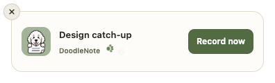
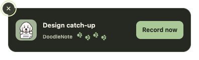

# ONY-269 desktop prompt QA

Synthetic-content QA on macOS / Electron 44, 2026-09-08. No real meeting,
calendar account, audio capture, installed app or production data was used.

## Presentation

The macOS window is 396×120 logical pixels (364×88 card plus a 16px transparent
gutter for the outside close control), bottom-centered with a 16px inset
inside the work area of the display nearest the cursor. The work area excludes
the Dock. Windows retains the existing top-right fallback and native-toast
preference. Expiry remains four minutes.

The paws use the existing DoodlingIndicator SVG geometry and 1.6-second staggered
walking animation. They are decorative, without generating-notes text or status.
Reduce Motion disables both the entrance and paw animation. Calendar titles are
escaped and truncate with a full-title tooltip.





## Repeatable native smoke

Install Playwright in a separate QA directory when it is not already available;
no repository dependency or lockfile change is needed. From the repository root:

```sh
DOODLE_PLAYWRIGHT_MODULE=/absolute/path/to/playwright \
DOODLE_QA_OUTPUT=/absolute/path/to/evidence \
node apps/desktop/scripts/test-prompt-panel.cjs
```

The script transpiles the actual panel implementation into an isolated temporary
Electron profile. Only synthetic meeting text and action counters are used. It
checks nonactivating appearance, native display bounds, hover/keyboard dismissal,
visible focus, both themes, reduced motion, enabled paw animation, one start
callback, closure during page load, replacement and expiry. Its timer shim shortens
only the four-minute expiry to 15 seconds; product timing is unchanged.

Observed revised native bounds: `{x:762,y:866,width:396,height:120}` inside work area
`{x:0,y:30,width:1920,height:972}`. `isFocused()` was false on appearance.
The screenshots show the actual BrowserWindow contents. The harness also verifies
that the bundled logo decodes, the title aligns with the branding, and the outside
X and its focus ring fit inside the transparent window.

## Automated evidence

- Full desktop suite, serial: `cd apps/desktop && pnpm exec tsx --test --test-concurrency=1 src/main/*.test.ts src/renderer/src/lib/*.test.ts`: 190 passed, 6 existing skips.
- The first concurrent `pnpm --filter desktop test` run hit an unchanged engine shutdown fixture startup timeout; the complete serial rerun, including that fixture, passed.
- `pnpm --filter desktop typecheck`: passed.
- `pnpm --filter desktop lint`: passed.
- `pnpm --filter desktop build`: passed.
- Prompt-coordinator tests cover macOS external-surface selection and preserve
  Windows fallback, calendar/microphone correlation, persisted cooldown and active
  recording suppression.
- Content tests cover exact CTA/dismiss destinations, escaping, decorative paws,
  reduced-motion/focus styles, negative display coordinates and small work areas.

## Combined recording-start integration

Verified in a detached local integration checkout combining:

- Current `main`: `e1e13fa` (source version 0.4.24).
- ONY-270 / PR #155: `43dbda4`.
- ONY-269 prompt implementation: `29f5623`.

The changes merge cleanly. Frozen install, desktop test (189 passed, six skipped),
typecheck, lint and build all pass on the combined tree. The real Electron
main/preload/React renderer with a synthetic engine also passed:

- Panel dismissal creates neither a meeting nor capture.
- Clicking Record now when the panel is the only window recreates the renderer
  and starts one intended calendar meeting.
- Repeated activation is rejected; active capture suppresses new prompts.
- Explicit start of an existing calendar meeting resumes capture without another
  meeting record.
- Banner dismissal closes the external panel.
- Engine failure retains actionable recovery without a false recording state.

After integrating PR #155 and building desktop, repeat with:

```sh
DOODLE_PLAYWRIGHT_MODULE=/absolute/path/to/playwright \
node apps/desktop/scripts/test-prompt-start.cjs
```

This harness instruments only the build inside an isolated temporary profile,
substituting a synthetic engine and observing the actual prompt callback. It
never starts a microphone or uses the user's app profile. Renderer assertions
wait for React updates, including while the main window is hidden.

## Remaining human and release gates

Merge ONY-270's reliable recording-start foundation before ONY-269. Its optional
CalendarService callback replaces the legacy renderer-delay handoff; this PR
keeps the prompt-specific change independently reviewable.

With that integration and a configured local audio engine, run
`pnpm --filter desktop dev`. Use safe content in an authorized test call:

1. Background, minimize and close the main window while leaving DoodleNote
   running. On each eligible new meeting, expect one bottom card, no focus change
   and no simultaneous native toast.
2. Start via the card or banner, including rapid/simultaneous activation. Expect
   one intended meeting and one capture; stop and reopen to verify saved audio
   and transcript. Repeat with an existing calendar-linked meeting.
3. Dismiss using hover X, keyboard Enter or Escape. Expect no recording or new
   meeting. Expect suppression while recording or with detection disabled.
4. Exercise a full-screen meeting app, each actual Dock/display arrangement,
   scaling, light/dark and Reduce Motion. Expect a visible, unclipped card and
   reachable controls; reduced motion should leave static paws.
5. Ignore a prompt for four minutes and quit with a prompt open. Expect the
   external surface to close.
6. Exercise missing permission/model recovery with a safe test profile. Expect
   actionable setup and no false recording indicator.

These physical/real-call checks have not been claimed as performed. ONY-225 /
PR #115 is independent; identify whether the non-default-microphone detector fix
is installed when testing release behavior. Source, build and synthetic QA are
not installed-client proof. Merge, packaging, publication and installed-version
verification remain separate authorized gates under `docs/RELEASING.md`.

## September 8 QA revision: distinct calls and card alignment

Alec confirmed the earlier start/capture checks, then reported missed later calls,
a misaligned card without the logo, and requested an outside top-left X. The revised
card reuses the existing mascot asset; its text shares one left edge and a centered
SVG close glyph sits across the top-left corner, reachable on hover or keyboard focus.

Local diagnostics showed recognized Chrome microphone joins suppressed by the
five-minute quiet period, and unrelated output changes restarting the four-second
debounce. The macOS watcher now assigns a distinct local identity after both call
input and same-app output have been absent for at least two seconds. A new call
can prompt after four seconds of microphone activity even within five minutes.
Repeated input/device/output events retain that original deadline. Once prompted
or recorded, a call stays consumed across mute with continuing output, short route
jitter, Stop, and monitor restart. Calendar correlation still uses the calendar
identity; Windows keeps its existing detector timing and presentation.

The two-second boundary is an audio heuristic, not provider session metadata.
Output alone never initiates a prompt. A fully muted join with no microphone
activity, same-browser calls with uninterrupted audio, or a reconnect losing both
input and output for more than two seconds cannot be distinguished reliably by
these existing signals. No browser extension, accessibility permission, or vendor
API was added. Native runtime tests feed synthetic Teams, Zoom and Chrome (Meet's
browser signal) NDJSON through the real parser/timers; they are not real vendor-call QA.

ONY-225 / PR #115 remains separately owned and absent from this branch and the
combined local preview. Its non-default microphone fix is not duplicated here.
Its legacy runtime test's five-minute cooldown expectation will need to account
for the macOS distinct-session behavior when those branches integrate.

Check this after installing an updated, authorized local QA build:

1. Background DoodleNote and join a safe Teams, Meet and Zoom call with microphone
   access. Expect one branded card after roughly four seconds of recognized input.
2. Leave completely, wait at least three seconds, and join another call within
   five minutes. Expect another card. Mute/unmute while call output stays active;
   expect no duplicate. Joining fully muted may require unmuting to expose input.
3. Confirm the logo, aligned text and outside X in light/dark. Hover and dismiss;
   expect no recording. Record now must still start exactly one capture.
4. With recording active or detection disabled, repeat the call activity; expect
   no prompt. Identify the selected microphone when reporting a missed prompt,
   because the separate non-default-input fix is not installed.

Revised real-call QA, human review and the authorized installed-app update remain
pending; earlier confirmations do not certify this revision.
