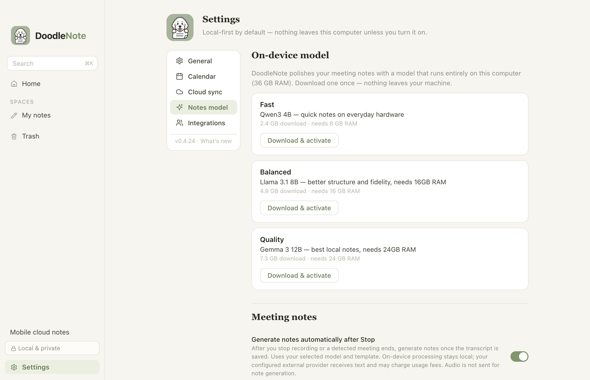
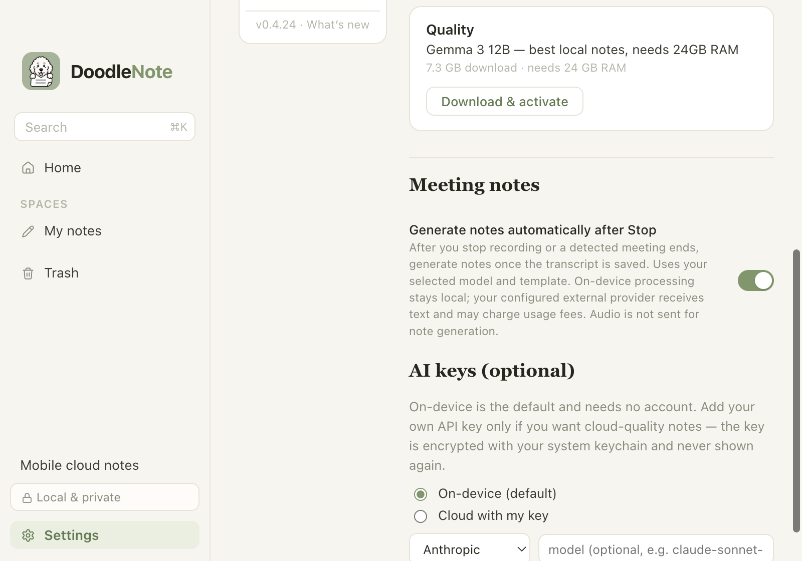
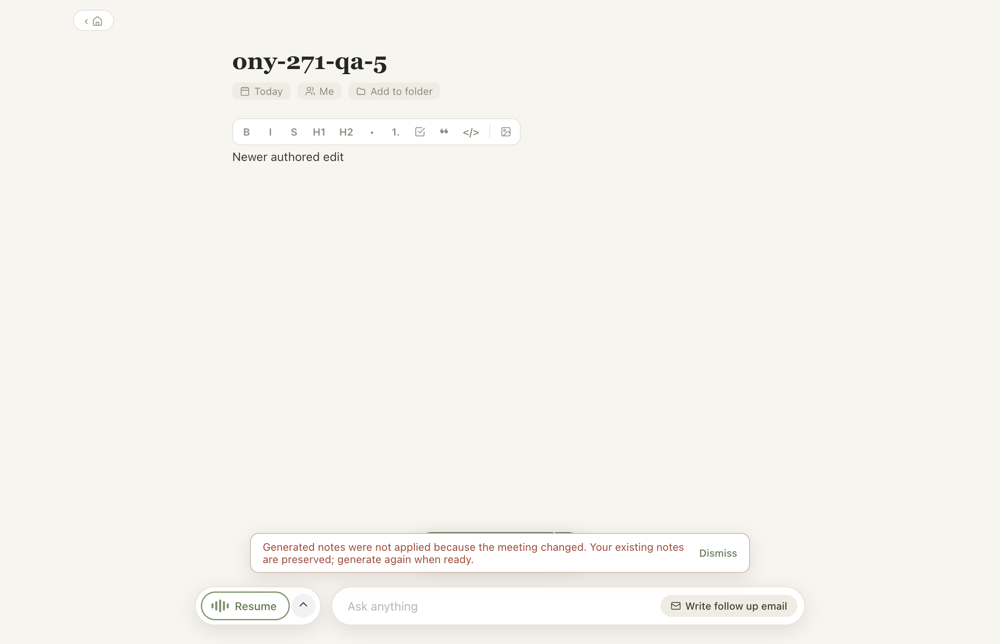

# ONY-271: automatic notes after Stop

## Delivered behavior

Settings → Notes model → **Generate notes automatically after Stop** defaults on,
including settings saved before this field existed. Explicit off applies to manual
and detected stops. The preference uses validated, atomic settings writes.

Main emits a capture-specific completion after transcript refinement, final segment
flush and session backup persistence. MeetingView consumes it once, saves the
meeting transcript before AI, and uses the current rough notes and selected
template/provider. Automatic work never falls back from an unavailable external
provider to another model. Existing manual generation fallback remains available.

A synchronous generation lock prevents repeated clicks/duplicate completion from
starting overlapping requests. Capture identity and edit revisions reject old
results after Resume, navigation, title/rough-note/roster/template changes. A
skipped or failed attempt has no pending retry tied to later model/settings changes.
Existing notes and transcript remain available for manual recovery.

## Automated evidence

- `pnpm install --frozen-lockfile` — passed.
- `pnpm --filter desktop test` — 181 passed, 6 existing skips, zero failures.
- `pnpm --filter desktop typecheck` — passed.
- `pnpm --filter desktop lint` — passed.
- `pnpm --filter desktop build` — passed.
- `git diff --check` — passed.
- `apps/desktop/scripts/test-auto-notes.cjs` — passed against the built Electron
  app on macOS. Real renderer, settings IPC, disk persistence and meeting store;
  synthetic capture events and deferred provider responses. The script creates
  an isolated profile and prints its evidence directory. No real meeting content,
  provider keys, or production profile are used.

The Electron smoke verifies on/off persistence through actual process restarts,
keyboard operation, invalid IPC input, settings-save failure rollback, the main
process disabled/missing-provider guards, both Stop routes, final refined wording,
fresh rough notes, a selected Standup template, duplicate completions, manual
double clicks, edit/Resume races, old capture completion, empty transcript,
unavailable model, finalization failure, provider error and manual recovery.

Run it with a separately installed Playwright test entry (no repo dependency change):

```sh
pnpm --filter desktop build
DOODLE_PLAYWRIGHT_MODULE=/absolute/path/to/playwright/test \
  node apps/desktop/scripts/test-auto-notes.cjs
```

## Check this: human macOS QA

Use a separate development profile and only synthetic meeting content:

```sh
pnpm install --frozen-lockfile
pnpm engine:build
DOODLE_USER_DATA="$(mktemp -d)" pnpm --filter desktop dev
```

1. Complete model/permission setup in that test profile. In Settings → Notes model,
   confirm the new switch starts on. Turn it off, restart using the same profile
   path, and confirm it remains off. At an 800 × 560 window, scroll to the row;
   the label, help text and keyboard-operable switch must remain accessible.
2. Turn it on, record a short test meeting, add rough notes and select a template.
   Stop manually: transcript/audio should finish saving before notes appear once.
   Repeat with a supported meeting app's detected ending; expect the same result.
3. Turn it off and repeat both Stop routes: transcript/audio save, no AI runs,
   and Generate notes remains available. Click Generate notes; expect one result.
4. While generation runs, edit rough notes or Resume recording: the old result
   must not replace newer work. Finish the resumed capture; its transcript includes
   both recording parts. Confirm notes and transcript after reopening/restart.
5. Exercise a missing model/key and a failing provider in the test profile: expect
   a clear recovery/setup message and saved transcript/audio. Fix the setup;
   generation should require a manual click, with no delayed automatic retry.

## Visual evidence

Built source 0.4.24 on macOS with an isolated synthetic profile; this is not an
installed-release claim. The same screenshots are generated by the smoke script.





## Remaining boundary

Physical microphone/system-audio capture, real meeting-app detection and actual
local/cloud inference have not been exercised by this smoke. Windows native QA
is also outstanding; shared finalization tests run locally and Windows packaging
is covered by repository CI. Human workflow approval is required before merge.

This is a source PR, not installed-app or release evidence. No release version,
updater feed, production settings, migrations or provider configuration are changed
by this issue. Release and installed-version verification require separate approval
under `docs/RELEASING.md`. The issue remains In Review until those boundaries are met.
