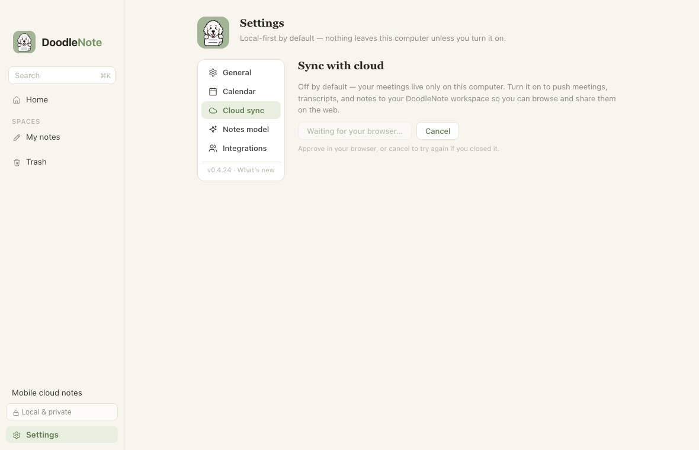
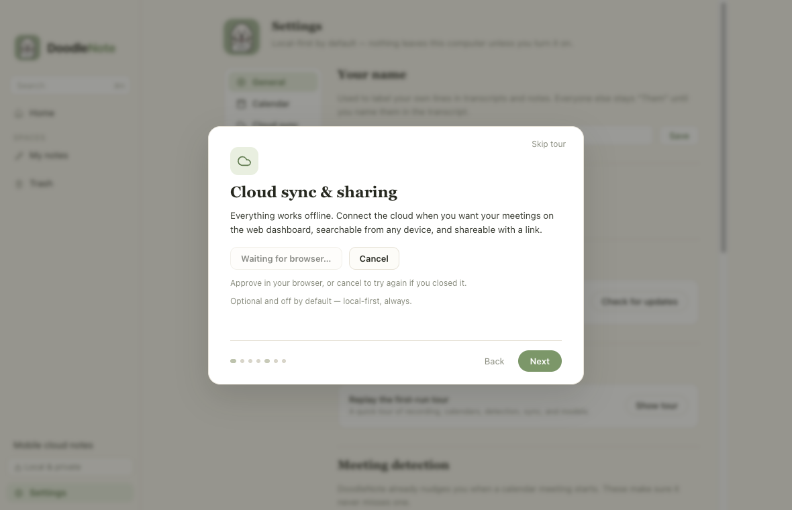
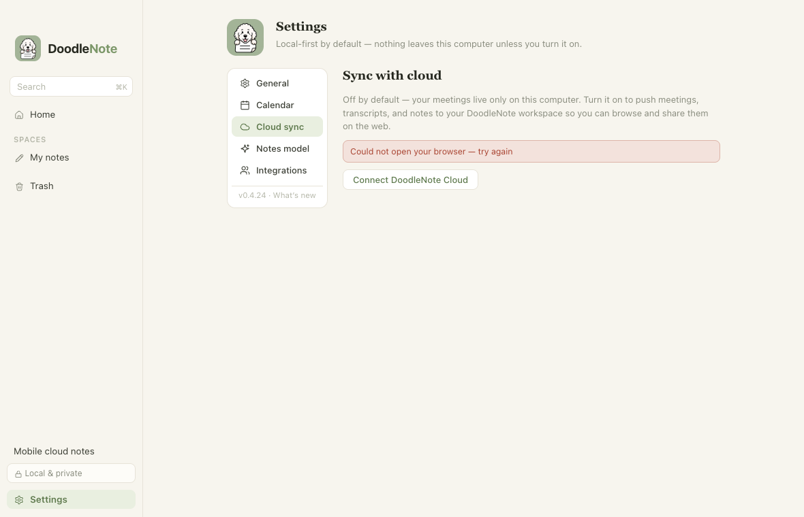
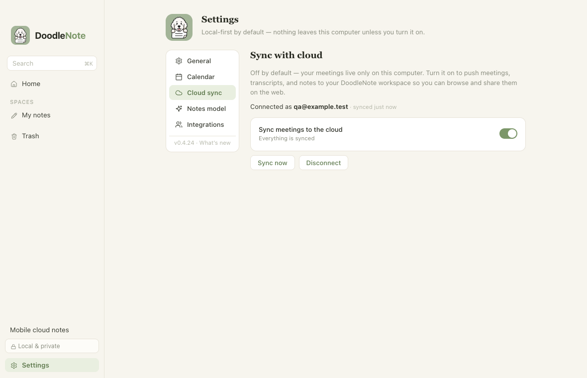
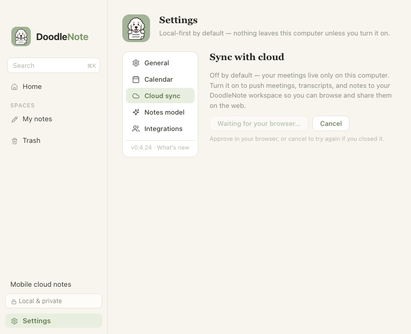

# ONY-273: cloud connection recovery

Settings and the welcome tour now offer **Cancel** while waiting for browser approval.
Cancel returns the Connect action immediately. A fresh attempt owns its own callback
listener and timer; retired callbacks, launch failures, and continuations cannot alter
its successor. Both views follow ordered main-process status events and reload status
on mount/Settings activation. App focus has no authorization or cancellation meaning.

## Evidence (2026-09-09)

Base: `68fbc7c0507c536ce04caed03dabf19f4935ede4` (`main`, desktop 0.4.24).
Baseline desktop tests: 175 passed, six existing platform skips, zero failures.

| Acceptance criterion | Evidence |
| --- | --- |
| Immediately cancel and reconnect after browser abandonment | Electron smoke exercised enabled Cancel, keyboard Enter, immediate retry, and compact layout in Settings and onboarding. |
| Success updates mounted views automatically | Real loopback fixture reached main-process service and preload; onboarding and already-mounted Settings both displayed the synthetic connected account. |
| Launch rejection, invalid callback, cancellation, timeout release resources | Unit tests use real loopback listeners plus fake opener/timers; closed ports reject requests. UI smoke covers launch rejection, invalid token and accelerated timeout recovery. Timer cleanup is centralized in the attempt's finish method. |
| Duplicate connect and stale-attempt isolation | Service tests prove one browser launch, preserved retry listener after the old continuation, no stale account encryption/upload, and safe disconnect/retry. Attempt tests exercise late opener rejection and old timeout deadline. |
| Focus is not evidence of closure/authorization | Electron smoke dispatches focus during pending state; it remains pending. There is no focus-based completion handler. |
| Navigation/remount reflects main status | Electron smoke changes Settings sections, reloads the renderer, mounts onboarding during a Settings attempt, and cancels/retries there. Status tests reject stale responses after newer events. |
| Cancel preserves existing account/notes and does not upload | Service test compares saved configuration and local fixture note bytes and verifies zero encryption/upload calls for an unfinished reconnect. |
| Credential and authorization boundaries | Only synthetic tokens and example.test identities in fixtures. Production safeStorage calls, web account/entitlement checks, and sync opt-in behavior remain in place. No web/protocol, permission, billing, or migration changes. |

Commands run successfully:

```sh
pnpm install --frozen-lockfile
pnpm --filter desktop test        # 188 passed, six existing skips, zero failures
pnpm --filter desktop typecheck
pnpm --filter desktop lint
pnpm --filter desktop build
```

The reproducible UI smoke requires a separately installed Playwright module:

```sh
DOODLE_PLAYWRIGHT_MODULE=/absolute/path/to/playwright/test \
DOODLE_QA_ARTIFACTS=/absolute/path/to/qa-output \
node apps/desktop/scripts/test-cloud-link-recovery.cjs
```

It launches the development Electron bundle with a fresh temporary profile and a
local synthetic cloud server. It replaces the browser opener and safeStorage only
inside that test process to avoid real authentication/Keychain access. The default
five-minute timer is accelerated for one UI case and tested at its actual duration
using fake timers in unit tests. This proves UI/IPC/lifecycle integration, not real
browser approval or installed-release behavior. No real account was connected or
local user library accessed. Native Swift/capture code is unchanged.

## Screenshots







## Check this: human QA

Use a controlled account and a fresh development profile containing only safe test
notes. From this branch, run `pnpm install --frozen-lockfile`, then launch:

```sh
DOODLE_USER_DATA="$(mktemp -d /tmp/doodle-cloud-human-qa.XXXXXX)" pnpm --filter desktop dev
```

1. With Safari as the default browser, open Settings → Cloud sync → Connect. Close
   only the link tab before login, then repeat during approval and with the whole
   browser closed. Back in DoodleNote, Cancel must remain enabled; pressing it must
   immediately restore Connect. Repeat with Chrome as the default browser.
2. Keep the browser tab open and return to DoodleNote; the attempt must stay pending.
   Change Settings sections and replay the welcome tour during linking; both must
   reflect the same attempt. Cancel with keyboard focus and retry without restart.
3. Approve a fresh attempt with the controlled account. Settings and the tour must
   display the connected account automatically without needing tab closure. Verify
   intended sync behavior using safe notes. Disconnect/reconnect, then confirm local
   content remains unchanged. An abandoned old callback must not replace the account.
4. At minimum window size, confirm Cancel and its explanation are readable and
   reachable. Review light/dark appearance and keyboard focus in both surfaces.

**Remaining physical QA:** actual Safari/Chrome tab/window closure and controlled
account approval were not performed. A designated human must run those cases.
Installed-client behavior awaits separately authorized release and installation;
this source branch has not replaced the installed app.

## Integration and release

One PR into main. Settings overlaps with #156/#154/#145/#117 are separate
model/recording areas; preload overlap with #155/#152 is separate recording/calendar
IPC. The sync IPC addition is internal to the desktop bundle. No required prerequisite
or web rollout. Recheck integration against the latest main before merge.

Required `checks` CI and CODEOWNERS review (Sean Inman or Alec Tribble, subject to
last-push approval rules) apply. Merge, package publication and installation remain
separate gates in `docs/RELEASING.md`. Rollback is a reviewed revert and separately
approved replacement release; preserve all user data. Linear stays In Review until
the issue's installed-and-verified completion boundary is met.

External API reference checked during delivery:
[Electron shell.openExternal](https://www.electronjs.org/docs/latest/api/shell#shellopenexternalurl-options).
