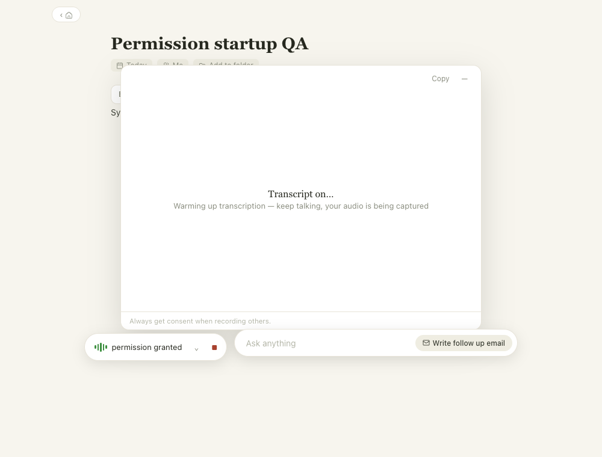
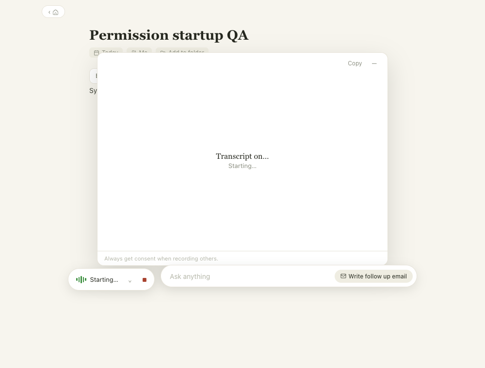
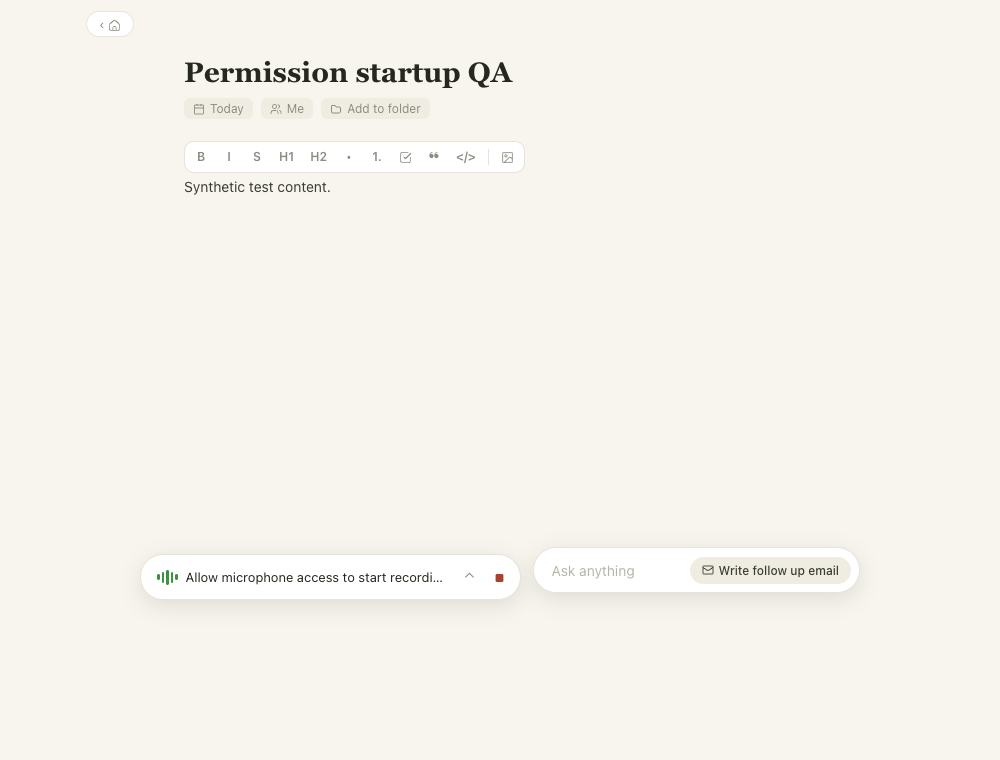
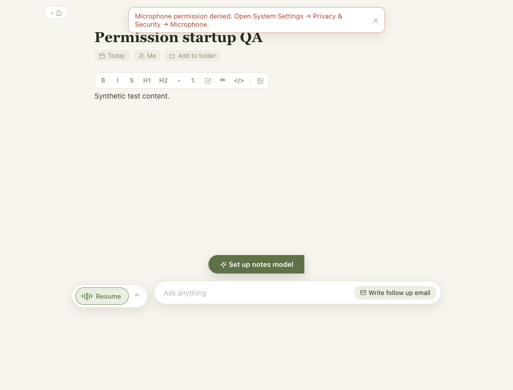
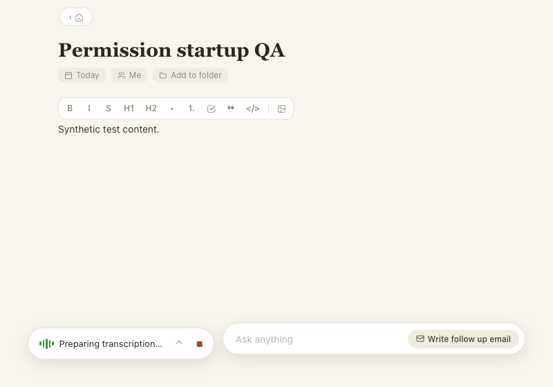

# ONY-275 — Startup permission status

Source base: `68fbc7c0507c536ce04caed03dabf19f4935ede4` (`main`).
Local verification: 2026-09-09, Apple Silicon macOS. All fixtures contain synthetic content.

## Root cause and outcome

App launch invoked full `preflight`, which requested mic access and ran a system-audio
probe on every launch. Live mic/tap startup emitted unconditional permission-request
and permission-granted stages. The recorder rendered unknown stages by replacing
underscores with spaces, exposing `permission granted` directly. The baseline renderer
replay reproduces both that text and the misleading macOS permission wait.

Launch now uses `preflight --models-only`. Visible onboarding retains full preflight.
Every mic start reads current OS authorization and requests consent only for
`notDetermined`; denied/restricted/revoked access cannot reuse an onboarding grant.
Tap/SCK creation and validation, silence detection, fallback, audio timestamps,
persistence and drain remain intact. System capture emits neutral startup status.
Only `ready` shows a recording timer. The transcript panel also waits for actual
capture readiness before claiming that audio is being captured. Specific permission
errors survive the subsequent engine exit.

Apple's current [authorization documentation](https://developer.apple.com/documentation/avfoundation/avcapturedevice/authorizationstatus(for:))
and [request-access documentation](https://developer.apple.com/documentation/avfoundation/avcapturedevice/requestaccess(for:completionhandler:))
were checked during implementation. System-audio taps deliberately do not use the
microphone authorization API or a cached onboarding flag.

## Automated and local evidence

- `pnpm install --frozen-lockfile` — passed; no lockfile changes.
- Baseline `pnpm --filter desktop test` — 175 passed, 6 skipped before native build.
- Final `pnpm --filter desktop test` — 185 passed, 1 existing skipped startup-recovery test.
  Building the native engine enabled five previously skipped native integration tests.
- `pnpm --filter desktop typecheck` — passed.
- `pnpm --filter desktop lint` — passed.
- `pnpm --filter desktop build` — passed.
- `pnpm engine:build` — passed; existing async `NSLock` warnings in `ServeCommand.swift`.
- `swiftc -parse-as-library engine/Sources/engine/MicrophoneAuthorization.swift engine/tests/MicrophoneAuthorizationTests.swift -o /tmp/doodle-permission-tests && /tmp/doodle-permission-tests` — passed.
  Covers authorized repeats, revocation, restriction, first-use grant/denial and recovery,
  with injected OS calls; never changes real TCC permissions.
- `engine/.build/release/engine preflight --models-only` — actual native run passed;
  output contained only `preflight_models` and `ready`, no capture/permission events.
- `DOODLE_PLAYWRIGHT_MODULE=/path/to/playwright node apps/desktop/scripts/test-permission-preflight.cjs` — passed.
  Actual built Electron app, isolated profile and fake engine: fresh launch and completed-profile
  relaunch each pass `--models-only`; explicit wizard IPC still invokes full preflight and
  returns mic/system-audio results. No real capture or personal profile access.
- `DOODLE_PLAYWRIGHT_MODULE=/path/to/playwright node apps/desktop/scripts/test-capture-permission-status.cjs --baseline` — reproduced both original messages using `origin/main`'s recorder.
- `DOODLE_PLAYWRIGHT_MODULE=/path/to/playwright node apps/desktop/scripts/test-capture-permission-status.cjs` — passed.
  Actual renderer with synthetic engine events: three start/Stop/Resume cycles, delayed
  success stages, readiness timer, finishing, first-use consent, denied+exit error persistence,
  and 800×560 model-loading copy. Unit tests also cover Windows preparation/refinement
  and delayed/unknown diagnostics.
- `git diff --check` — passed.

## Visual evidence

These are renderer replays, **not installed-client or real OS permission proof**.

| Before | Authorized startup |
| --- | --- |
|  |  |





## Check this: real Mac QA remaining

For development-only checks, use a separate test macOS account/profile and run:

```sh
pnpm install --frozen-lockfile
pnpm engine:build
DOODLE_USER_DATA="$(mktemp -d /tmp/ony275-human-qa.XXXXXX)" pnpm --filter desktop dev
```

A separate Electron profile does **not** isolate TCC. Fresh/denied/revoked permission
testing needs a dedicated macOS test account or separately authorized signed test identity.
Do not reset the user's TCC or change their recording grants. Signing, installing, and
release testing require the separate delivery-stage authority.

1. With grants already established, quit/relaunch twice; expect no startup permission probe
   or consent UX. Start/Stop/Resume three safe test meetings; expect normal startup followed
   by the timer, with no `permission granted` or false permission-wait text.
2. In the fresh test account/identity, enter transcription onboarding. Grant permissions and
   verify the displayed mic/system-audio results and a successful first recording. Deny in
   a separate controlled case; verify recovery guidance remains visible.
3. Revoke microphone permission for that test identity after onboarding, then record.
   Expect actionable failure and no recording timer/success. Restore access and retry.
   Exercise supported restricted-device policy separately where available.
4. Using safe spoken/test audio, verify mic-only, system-only and both sources with the
   process-tap path and SCK fallback. Stop/drain, play the saved audio, check transcript
   timestamps and resume continuity. Deny system capture and verify actual failure/fallback
   without a false successful-capture state.
5. On Windows, check startup/model-loading, Stop/refinement and denied-device errors;
   expect platform-neutral text. Physical Windows capture was not tested on this Mac.

These physical/TCC checks remain unverified. The contract permits PR handoff with this
explicit physical-QA blocker; it does not permit marking the issue Done. The completion
boundary remains an installed build verified after separately approved release.

## Integration and release

Keep the PR focused; arrow alignment and loading animation remain separate issues.
PR #154 has adjacent completion semantics, #155 has recorder-start wiring, and #145
changes native model/language setup. This patch preserves their independent behavior;
revalidate the combined result when landing them. No schema, data migration, version bump,
signing, installation, updater or publication change is included. Rollback is a reviewed
source revert followed by an authorized replacement release.
