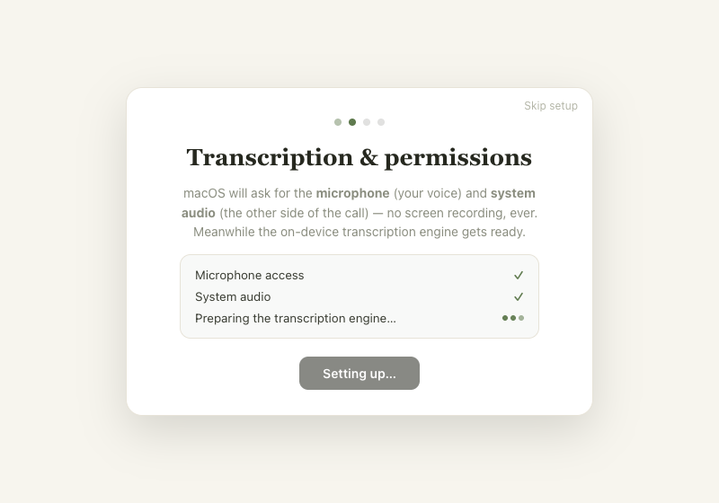
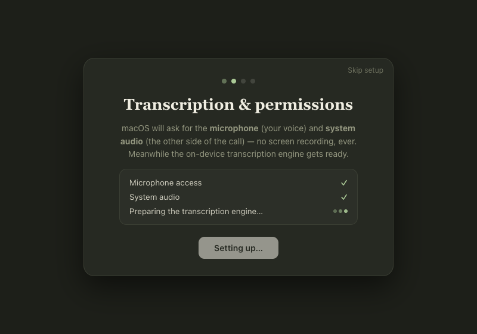
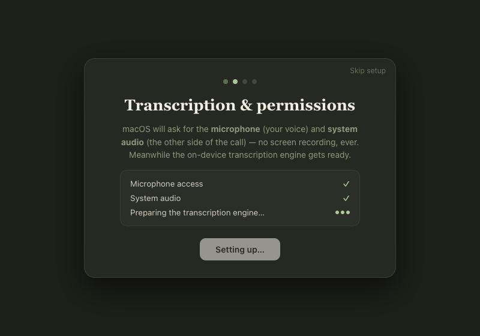
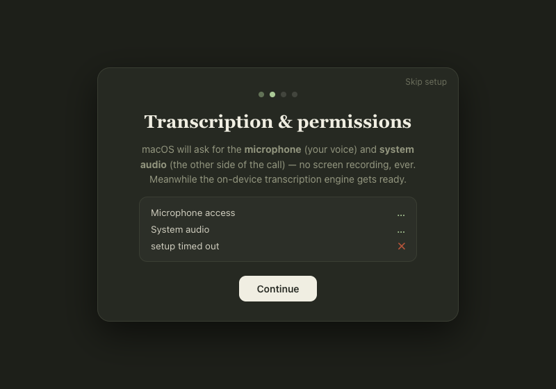
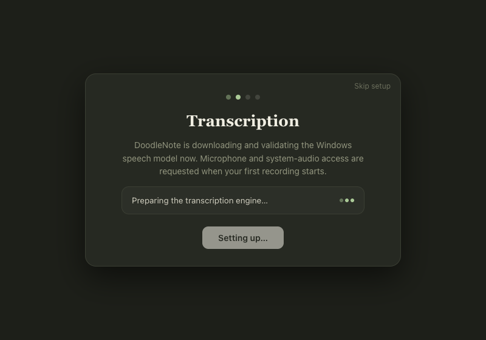

# ONY-277: transcription setup loading feedback

Base: `68fbc7c0507c536ce04caed03dabf19f4935ede4` (`main`).
Desktop source version: 0.4.24. QA performed on macOS with the actual React wizard
and stylesheet bundled into Chrome, using synthetic preflight events/results.
This is renderer evidence, not installed-client or native Windows evidence.

## Outcome and reproduction

The engine row previously rendered a static ellipsis whenever setup was running.
A rejected preflight IPC promise also left the wizard disabled with an unhandled
rejection. The baseline replay confirms both behaviors.

The running row now renders three opacity-pulsing dots with fixed dimensions.
It uses a polite atomic status region containing the existing explanatory text;
decorative dots and terminal symbols are hidden from assistive technology.
Reduced motion disables animation and leaves solid dots with explicit preparation
text and the disabled “Setting up…” button. Actual download progress remains
independent, with an accessible progress-bar name.

Rejected preflight calls now settle into the existing error UI. Ready/error/result
completion clears progress. Leaving the step unsubscribes, and late promise
completion does not update the departed UI. Skip does not cancel background work.
No service, permission, model, IPC contract, dependency, or release changes.

## Verification

- `pnpm install --frozen-lockfile` — passed.
- `pnpm --filter desktop typecheck` — baseline and changed source passed. An initial
  attempt before dependency linking completed could not find `tsc`; rerun passed.
- `pnpm --filter desktop test` — 175 passed, 6 existing environment-dependent skips,
  no failures (181 total).
- `pnpm --filter desktop lint` — passed.
- `pnpm --filter desktop build` — passed.
- `git diff --check` — passed.
- Controlled renderer harness, commands below — baseline reproduction and fixed
  behavior passed. It uses an existing separately installed Playwright runtime;
  no repository dependencies or lockfile changes are required.

```sh
DOODLE_PLAYWRIGHT_MODULE=/path/to/playwright \
  node apps/desktop/scripts/test-transcription-setup.cjs --baseline
DOODLE_PLAYWRIGHT_MODULE=/path/to/playwright \
  node apps/desktop/scripts/test-transcription-setup.cjs
```

The harness prints its artifact directory. Set `DOODLE_QA_ARTIFACTS` to choose one.
It imports the real component/CSS, mocks only preload APIs, and never accesses
user profiles, captures audio, requests permissions, or downloads models.

| Acceptance behavior | Evidence |
| --- | --- |
| Immediate activity during Getting ready and null-progress preparation | Three dots on entry; animation samples across 1.6 seconds with no new events |
| Continuous activity with accurate numeric progress | Download fixture keeps value `0.37`; animation remains active |
| Terminal success and failure replace activity | Ready event/result, error event, failed result, timeout result, rejected promise all remove loading animations and progress; Continue enabled |
| Existing permission/Skip/Continue behavior | Granted checkmarks, denied guidance, disabled setup CTA, Continue to Notes model, keyboard Enter on Skip; old background completion after fresh mount does not affect new setup |
| Compact theme/layout stability | 800×560 viewport, light and dark; every sampled row and CTA rectangle identical across animation frames; screenshots inspected |
| Reduced motion and accessibility | Animation `none`, opacity `1` for each dot; accessible tree contains `status: Preparing the transcription engine…`; numeric progress has a name; actual VoiceOver speech remains human QA |
| Windows and fresh sessions | Windows title/copy with no macOS permission rows; one preflight and notes subscription each while active, both zero after Skip; remount and old completion isolation pass; native Windows remains human QA |

## Visual evidence

[Animation and terminal transition recording](ony-277/transcription-setup.webm)







## Check this:

1. Watch the recording at the preparation and download stages. Expect gentle
   sequential dots with stable text/button positions, then no dots after ready/error.
2. Compare light/dark and reduced-motion screenshots. Expect visible dots and
   legible existing copy; reduced motion must remain stationary.
3. For native macOS/VoiceOver QA, use an exclusive checkout and a dedicated profile:
   `pnpm engine:build`, then
   `DOODLE_USER_DATA="$(mktemp -d /tmp/ony277-human.XXXXXX)" pnpm --filter desktop dev`.
   Enter Transcription & permissions; expect meaningful preparation/terminal
   announcements without per-frame speech. Enable macOS Reduce motion and expect
   stationary dots. Skip should dismiss setup immediately. Real setup may request
   OS permissions/download models, so use an approved test environment.
4. On a supported Windows test machine, enter first-run Transcription. Expect
   Windows-specific model copy, no macOS permission rows, and loading replaced
   by the correct terminal state.

## Review and release boundaries

Maintainer review and native product QA remain required. The checked-in recording
proves the controlled renderer animation, not actual engine/download timing.
No packaging, signing, installation, merge, deployment, or release was performed.
The issue remains In Review until the separately approved installed-release
completion boundary is verified. No migration is needed; revert this focused
renderer change to roll it back.

Other open wizard work in PR #156 touches the separate Notes model section;
PRs #151/#154/#161 touch other CSS selectors. This change has no prerequisite on
those PRs. Recheck integration against their final diffs before merge.
