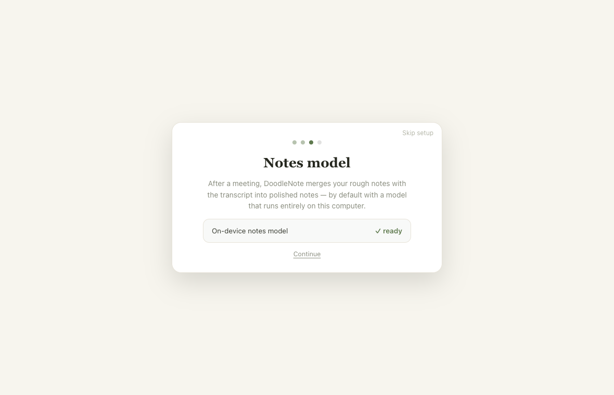
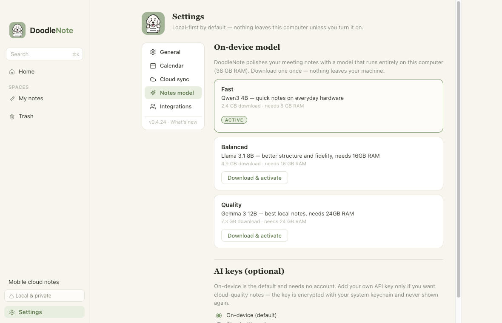
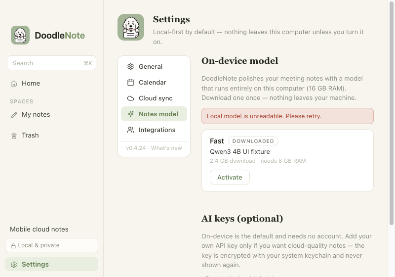

# ONY-278 — Reuse installed local notes models

The model picker and generation path now use the same asynchronous resolver.
Search order is the current profile's `models`, then `DoodleNote/models`,
`desktop/models`, and `DoodleNote Local/models` under Electron's `appData`,
then `~/.cache/doodle-note/models`. No recursive scan or provider integration
is performed. Overriding `DOODLE_USER_DATA` isolates application data while
still allowing read-only reuse of these model caches.

## Artifact validation and ownership

Candidate names may differ, but their byte count and full SHA-256 must match
the catalog artifact. This verifies the exact publisher model, revision and
quantization, not merely a plausible filename/header. Hashing uses streaming
I/O; successful/failed digests are cached in memory only while device, inode,
size, mtime and ctime remain unchanged. Missing/unreadable files and `.ipull`
markers are rejected. A new app process revalidates. No online metadata call
is needed for a local hit. Repacks or new publisher revisions require an
explicit catalog update, with newly verified provenance.

Publisher LFS metadata was read on 2026-09-08 from:

- [Qwen3-4B-Instruct-2507](https://huggingface.co/unsloth/Qwen3-4B-Instruct-2507-GGUF/tree/a06e946bb6b655725eafa393f4a9745d460374c9)
- [Meta-Llama-3.1-8B-Instruct](https://huggingface.co/bartowski/Meta-Llama-3.1-8B-Instruct-GGUF/tree/bf5b95e96dac0462e2a09145ec66cae9a3f12067)
- [gemma-3-12b-it](https://huggingface.co/unsloth/gemma-3-12b-it-GGUF/tree/d15e4c7dc21dc55d56bf8549db57a71ad8a2a35d)

The catalog records each exact file URI, commit, size and checksum. New
explicit downloads use that pinned URI in a unique staging directory inside
the requesting profile. Only validated weights are atomically published under
a unique `.gguf` filename; errors remove only this attempt's staging directory.
Discovery ignores staging. Requests in one service are serialized, and the
store coalesces identical concurrent installs. Different running profiles do
not acquire a global download lock; each owns its new downloads. Existing
files are never moved, overwritten or deleted. Earlier duplicates remain.

The legacy profile migration no longer copies weights. Its existing meetings
and settings migration is otherwise unchanged. Model reuse itself never reads
another profile's notes/settings. Selection remains in the current settings;
the resolved path is rediscovered on restart. If its source cache is removed,
generation returns an actionable error; it does not silently download or
switch to a cloud provider. Rollback leaves original cache files intact; old
clients may not recognize newly published uniquely named files.

## Reproducible checks

```sh
pnpm install --frozen-lockfile
pnpm --filter @repo/ai test
pnpm --filter @repo/ai typecheck
pnpm --filter desktop test
pnpm --filter desktop typecheck
pnpm --filter desktop lint
pnpm --filter desktop build
```

Resolver tests cover legacy/current precedence, restart, a model appearing
after the initial UI miss, incompatible contents, corruption/truncation,
partial markers, unreadable files, changed/removed references, download
failure and retry, staging visibility, and repeated activation. Fixtures are
small synthetic files and never download weights. Desktop path tests also run
on Windows CI; the POSIX unreadable-file case is explicitly skipped on Windows.

Real-model smoke (requires an existing catalog Qwen, never downloads):

```sh
cd packages/ai
/usr/bin/sandbox-exec -p '(version 1)(allow default)(deny network*)' \
  node --import tsx scripts/local-model-reuse-smoke.ts \
  "$HOME/Library/Application Support/desktop/models"
```

The macOS smoke passed with all network operations denied: 2,497,281,120-byte
Qwen verified in about 1.5 seconds, a new resolver found the same path, and
real local inference generated the Friday demo/Thursday checklist summary.
Source inode remained unchanged and the fresh profile had no model directory.
This proves engine behavior, not a signed/installed release or physical Windows.

Optional Electron UI/IPC smoke:

```sh
DOODLE_PLAYWRIGHT_MODULE=/absolute/path/to/playwright/test \
  node apps/desktop/scripts/test-local-model-reuse.cjs
```

It uses a temporary profile, actual cache discovery/activation and a real app
restart. ASR/permissions preflight is a fixture so it cannot record or download
speech models. Later phase/error fixtures are explicitly separate from real
model activation. It records setup readiness, Settings after restart, local
loading without a download bar, and a recoverable error at compact size.

This Electron smoke passed on macOS: actual activation emitted only `checking`
and `loading`, persisted Qwen selection across an app restart, and created no
model folder in the new profile. All four screenshots were visually inspected.





## Human QA and release gate

1. Launch `DOODLE_USER_DATA=/absolute/path/to/a-new-test-profile pnpm --filter desktop dev`
   with compatible Qwen already in a known cache. At Notes model setup expect
   readiness without a second download. In Settings expect Qwen active/available.
2. Generate notes from a short synthetic meeting offline. Relaunch, generate
   again, and confirm no new multi-GB model file in the test profile.
3. With controlled fixture caches (do not damage a personal installation),
   test missing/unreadable/corrupt files: recovery offers activation/download;
   no false Active state. Real downloads show percentage; local checking/loading
   does not. Retry controls recover after failure.
4. Check model state announcements with VoiceOver, keyboard access, light/dark
   themes and the compact window. Verify other selected local/provider models
   and Windows behavior on supported hardware.

Physical Windows and an approved signed/installed release remain human/release
gates. PR #154 (ONY-271) overlaps `pickEngine` and settings; whichever merges
second must preserve async resolution together with its selected-provider and
automatic-generation guards. No schema migration or publication is included.
