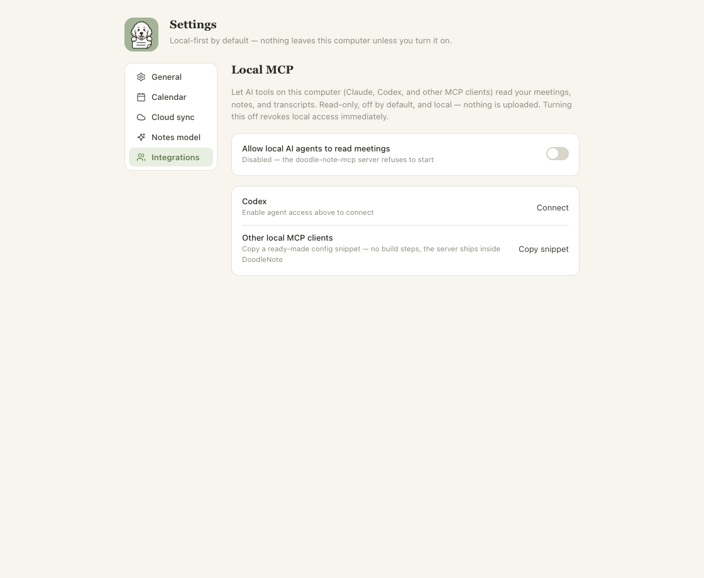
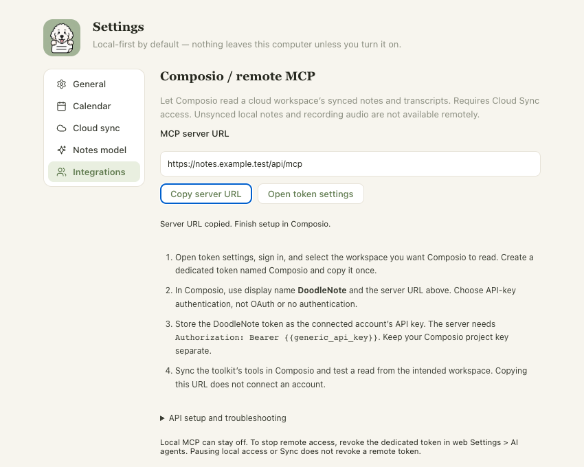

# ONY-279: remote MCP visibility for paid subscriptions and active trials

Base: main `1b22e72`. Scope: desktop setup visibility and an additive authenticated
account field. General Sync entitlement and hosted MCP authorization are unchanged.

## Evidence (2026-09-09)

- Frozen install: `pnpm install --frozen-lockfile --ignore-scripts` passed.
- Pre-edit baseline: desktop remote setup tests 4/4 and web billing-state/account
  tests 13/13 passed. New eligibility tests failed before their implementation.
- `pnpm --filter desktop test`: 175 passed, 6 existing platform skips, 0 failures.
- `pnpm --filter web test`: 127 passed.
- `pnpm --filter doodle-note-mcp test`: 5 passed.
- `pnpm --filter desktop typecheck`, `lint`, `build`: passed.
- `pnpm --filter web typecheck`, `lint`: passed.
- `DOODLENOTE_SELF_HOSTED=true pnpm --filter web build`: passed. This build-only
  setting provides public CI configuration; it does not grant paid UI visibility.
- `DOODLE_PLAYWRIGHT_MODULE=/absolute/path/to/playwright node apps/desktop/scripts/test-remote-mcp-visibility.cjs`:
  passed in headless Chrome against the actual ModelsView and CSS with synthetic
  preload APIs. No real account, meeting content, audio capture, or purchase used.

## Acceptance evidence

| Contract criterion | Evidence |
| --- | --- |
| Active paid and trialing show setup | Billing matrix, authenticated account endpoint tests, renderer harness |
| Grandfathered-only, past-due, canceled, unpaid, incomplete, missing or unlinked hides it | Server matrix and default-deny renderer; unlinked transition checked |
| Broad entitlement, token and upload toggle are insufficient | Endpoint matrix keeps broad Sync states unchanged; desktop client demands explicit eligibility; renderer paid fixture has uploads paused |
| Pending, malformed, error, unauthorized and missing-field replies hide it | Main client tests plus rendered pending/offline/failure and recovery |
| Reopen/account/server changes, stale responses, paid-state revalidation | Renderer reopen/focus/online and account revision tests; client token/server/revision race tests |
| Scheduled cancellation remains visible during active paid status | Billing-state test confirms active then canceled, preserving existing webhook status contract |
| Local MCP works without a paid plan | Existing MCP tests; renderer toggles Local MCP, connects Codex, and copies the local config while unpaid |
| Auth/account isolation and old API fields preserved | Actual account route uses in-memory DB and device tokens; spoofed user query ignored, workspace membership revocation returns 401, existing response fields asserted |
| No blank spacing/tab stops; paid keyboard controls and compact layout | Actual rendered screen screenshots below; absent remote DOM; keyboard copy at 850 x 680 |




## Human QA and remaining delivery gates

The harness verifies React rendering and the IPC-facing behavior with synthetic
bridges, not the installed Electron app against a deployed billing endpoint.
Real macOS/Windows account, OS clipboard and installed-release QA remain required.

From a clean checkout of the issue branch:

```sh
pnpm install --frozen-lockfile
pnpm engine:build # macOS native engine; use the repository Windows setup on Windows
pnpm --filter desktop dev
```

Use a dedicated `DOODLE_USER_DATA` profile and an approved test server/account when
performing account QA. For an isolated server, configure `DOODLE_SYNC_URL` to that
server before launching the desktop. Its account route must include this change.
Use Stripe test fixtures or existing approved accounts; no live charge is needed.
The normal zero-config/self-hosted server deliberately has no paid eligibility.

Check this:
1. Link an active paid or active-trial test subscriber. Open Settings > Integrations; expect the
   remote setup section. Pause uploads; reopen Integrations and expect it still.
2. Use grandfathered-only, past-due and expired/unlinked profiles; expect
   only Local MCP. An active paid subscription scheduled for future cancellation
   should still show setup until billing changes out of active.
3. Return from billing after changing the fixture state, disconnect/switch account,
   or disconnect/reconnect the network; expect a fresh check with no stale grant.
4. Enable Local MCP while unpaid, connect/disconnect a local client and copy its
   snippet. Tab through the compact settings view; no hidden remote controls
   should receive focus, and paid Copy server URL should copy just the HTTPS URL.

Deploy compatible server support before the approved desktop release. Old servers
fail closed for section visibility. No migration is required. Roll back through a
focused revert and a separately approved release. Signing, publication, updater
availability and installed-version verification remain separate gates.


## Authorized Cloud release preparation (2026-09-09)

The combined macOS local preview includes the desktop change. Native installed-app
inspection verified that an unlinked profile hides remote setup while retaining
Local MCP. A subsequently linked account synced successfully but remained hidden:
the production server at `1b22e72` does not return `remoteMcpEligible`. The live
paid-account reveal therefore remains pending the compatible Cloud rollout.

The owner authorized resolving release blockers and deploying Cloud after checks
and review pass. This excludes publishing a new desktop release. The audit fixes
update Next.js and its matching ESLint config to 16.3.3 and pin patched compatible
transitive dependencies: js-yaml 4.3.2, baseline-browser-mapping 2.11.0, and
Browserslist 4.28.7. The latter addresses advisories exposed through the updated
Next.js production dependency graph. No audit exclusions were added.

Verification on the updated lockfile: frozen install and production audit passed
(no known vulnerabilities); desktop typecheck and 175 tests passed with 6 existing
platform skips; web typecheck, 127 tests, authentication smoke and production build
passed; Local MCP 5 tests, notes engine 16 tests, database 30 tests and workspace
lint passed. GitHub CI and code-owner approval must pass on the final commit before
merge and Cloud deployment. The installed paid-account reveal must then be
verified separately. No schema migration or billing-data edit is required.


## Active Cloud Sync trial policy update (2026-09-09)

The owner confirmed that active Cloud Sync trials should also see remote setup.
The server predicate now permits persisted `active` and `trialing` states while
continuing to reject missing, expired/canceled, past-due, unpaid, incomplete,
grandfathered-only, and self-hosted/development-only access. General entitlement,
token authorization, trial length and billing state are unchanged. The installed
desktop already consumes the existing boolean, so no desktop update is needed.

Before the predicate change, the updated status matrix, authenticated account
route and trial lifecycle regression checks failed on `trialing`. Verify they pass
after the change, deploy the compatible server, then reopen Integrations in the
linked trial account and confirm the complete setup appears beside Local MCP.

Follow-up local verification passed: frozen install, 128 web tests, web typecheck,
lint, authentication smoke, production build, and production dependency audit
(no known vulnerabilities). GitHub checks and live trial-account verification
remain separate deployment gates.
